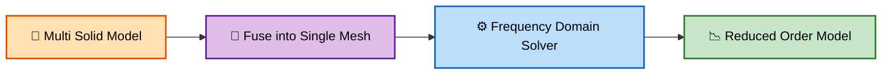
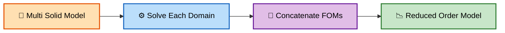
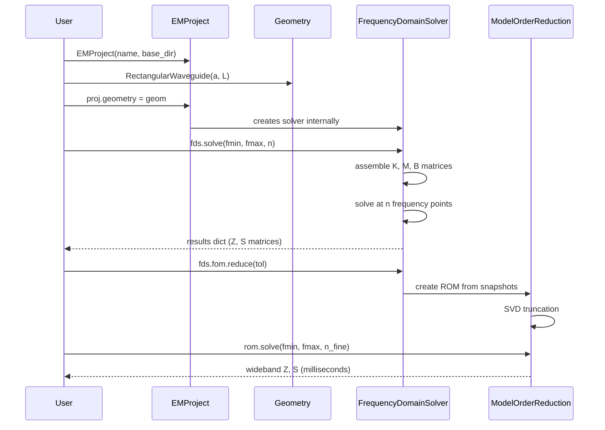
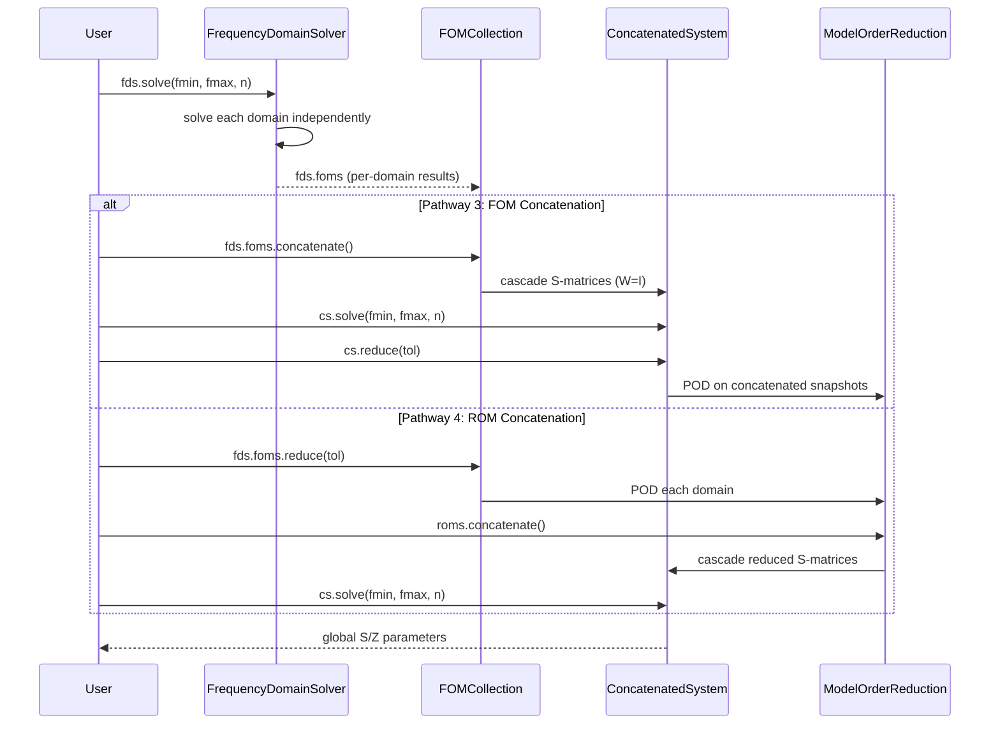

# Architecture

**cavsim3d** provides four distinct analysis pathways for electromagnetic cavity simulation. The choice depends on the complexity of the geometry and the desired balance between accuracy and computational efficiency.

## Analysis Pathways Overview

The figure below shows the software architecture with the available analysis options for single-segment and multi-segment assemblies.

### Pathway 1 — Single Solid


### Pathway 2 — Global Assembly



### Pathway 3 — FOM Concatenation



### Pathway 4 — ROM Concatenation


---

## Pathway Details

### Pathway 1: Single Solid Model

The simplest pathway. A single geometry is meshed and solved globally. Best for small, simple cavities or waveguides.

| Step | Code | Description |
|------|------|-------------|
| Geometry | `RectangularWaveguide(a, L)` | Create a primitive or import a single CAD file |
| Mesh | `geometry.generate_mesh(maxh)` | Generate the finite element mesh |
| Solve FOM | `fds.solve(fmin, fmax, n)` | Full-order frequency sweep (few sample points) |
| Reduce | `fds.fom.reduce(tol)` | POD-based model order reduction |
| Solve ROM | `rom.solve(fmin, fmax, n)` | Wideband sweep on the reduced model (fast) |

**When to use:** Single cavities, simple waveguides, quick studies.

---

### Pathway 2: Multi-Solid, Global Assembly

Multiple parts are assembled and fused into a single mesh. The solver treats the entire assembly as one domain.

| Step | Code | Description |
|------|------|-------------|
| Assembly | `proj.create_assembly()` | Create an assembly container |
| Add Parts | `assembly.add("name", part)` | Add parts; they are auto-aligned |
| Build | `assembly.build()` | Fuse geometry into a single solid |
| Solve FOM | `fds.solve(fmin, fmax, n)` | Global frequency sweep |
| Reduce | `fds.fom.reduce(tol)` | POD reduction on global matrices |
| Solve ROM | `rom.solve(fmin, fmax, n)` | Wideband sweep |

**When to use:** Small multi-component systems where global coupling is important and the mesh is manageable.

---

### Pathway 3: Per-Domain FOM Concatenation

Each solid is solved independently, producing per-domain Full Order Models (FOMs). These are then concatenated via Kirchhoff coupling (S-matrix cascade) to produce the global response.

| Step | Code | Description |
|------|------|-------------|
| Geometry | Multi-solid or split CAD | Each solid gets its own mesh and domain |
| Solve Per-Domain | `fds.solve(fmin, fmax, n)` | Solves each domain independently |
| Concatenate FOMs | `fds.foms.concatenate()` | Cascade S-matrices at shared interfaces |
| Solve Concat | `cs.solve(fmin, fmax, n)` | Solve the concatenated system |
| Reduce | `cs.reduce(tol)` | POD on the concatenated snapshots |

**When to use:** Large assemblies where global meshing is impractical. Allows reuse of unchanged domain FOMs.

---

### Pathway 4: Per-Domain ROM Concatenation

The most efficient pathway. Each domain is **first reduced** independently, then the ROMs are concatenated. This gives massive speedups for systems with many repeated or similar components.

| Step | Code | Description |
|------|------|-------------|
| Geometry | Multi-solid or split CAD | Each solid gets its own mesh and domain |
| Solve Per-Domain | `fds.solve(fmin, fmax, n)` | Solves each domain |
| Reduce Per-Domain | `fds.foms.reduce(tol)` | POD reduction on each domain |
| Concatenate ROMs | `roms.concatenate()` | Cascade reduced S-matrices |
| Solve Concat | `cs.solve(fmin, fmax, n)` | Solve concatenated ROM system |

**When to use:** Large multi-component systems with many frequency points. If one component changes, only its ROM needs recomputation.

---

## Object Interaction

The following sequence diagram shows the typical interaction flow for a single-solid analysis (Pathway 1):



The following shows the multi-solid concatenation flow (Pathway 3/4):



---

## Computation Graph Summary

The entire computation graph is navigable via attribute access:

```
Single-Solid:
  proj.fds.fom                    → FOMResult
  proj.fds.fom.reduce()           → ModelOrderReduction
  rom.solve(fmin, fmax, n)        → (updates ROM in-place)

Multi-Solid:
  proj.fds.foms                   → FOMCollection (per-domain)
  proj.fds.foms[0]                → FOMResult (first domain)
  proj.fds.foms.concatenate()     → ConcatenatedSystem (FOM-level)
  proj.fds.foms.reduce()          → ROMCollection (per-domain ROMs)
  roms.concatenate()              → ConcatenatedSystem (ROM-level)
  cs.solve(fmin, fmax, n)         → (updates CS in-place)
  cs.reduce()                     → ModelOrderReduction (2nd-level)
```
