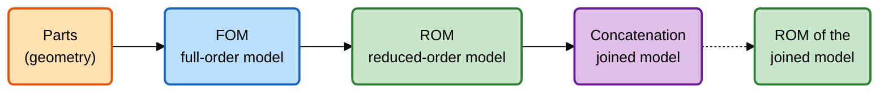
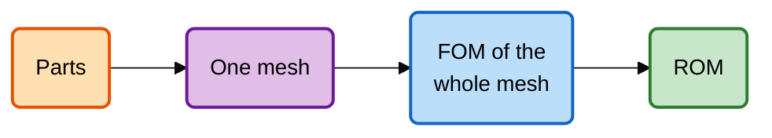
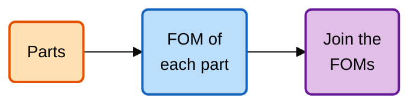
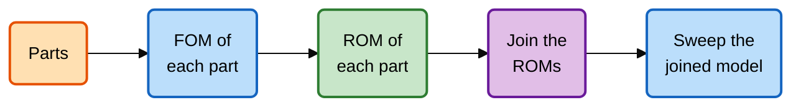

# How a model is solved in pieces

A frequency sweep of a large RF structure is expensive: every frequency needs the solution
of a finite-element system with hundreds of thousands of unknowns. The code is built
around two ideas that cut this cost: **reduce** a full-order model to a small one that can
be swept cheaply, and **solve large structures in pieces** that are joined afterwards. This
page explains the stages of that pipeline and the ways of combining them.

## The stages

Every analysis runs through the same staged pipeline, driven by the frequency-domain solver
`proj.fds`. Each stage is a real object, saved in the project folder as soon as it is
computed, and reloaded instead of recomputed when the project is opened again.

1. **Full-order model (FOM).** The solver builds the finite-element space on the mesh,
   assembles the system matrices (stiffness $\mathbf{K}$, mass $\mathbf{M}$, port
   excitation $\mathbf{B}$), computes the port modes, and solves at every requested
   frequency. The result is the S- and Z-parameters at those frequencies and the field
   solutions ("snapshots"). `proj.fds.solve()` → `proj.fds.fom` (one part) or
   `proj.fds.foms` (one per part or domain).
2. **Reduced-order model (ROM).** The snapshots span a small subspace in which the field
   lives across the band. Projecting the system onto it gives a model with tens of
   unknowns instead of hundreds of thousands. `fom.reduce(tol)` → `fom.rom`;
   `foms.reduce(tol)` → `foms.roms`. See [How model order reduction works](model_reduction.md).
3. **Concatenation.** The reduced models of several parts are joined through the port
   modes on the faces they share: the tangential fields must match there. The result is
   one model of the whole structure. `roms.concatenate()` → `roms.concat`.
4. **Further reduction (optional).** A joined model can be reduced again, for example
   before many sweeps. `concat.reduce(tol)` → `concat.rom`.

Only the joined model (stage 3) is self-contained; the earlier stages refer to the parts
they came from.

The attribute paths mirror the number of objects at each stage:
`proj.fds.fom.rom` for a single part, `proj.fds.foms.roms.concat` for several.

## Three ways to solve a model of several parts

A model of several parts (or a CAD model cut into domains) can go through the pipeline in
three ways. All three give the same answer to within the accuracy of the reduction; they
differ in cost and in what can be reused.

### In one piece

`proj.fds.solve(..., per_domain=False)` treats the whole mesh as one system with only the
external ports. Nothing is reused when a part changes, and the largest system is the
whole model. It is the natural reference when checking the other two.

### Per part, joined at full order

`proj.fds.foms.concatenate()` joins the full-order models without reducing them. The joined
system is as large as the whole model and, unlike the original sparse system, dense: it is
slow and memory-hungry, and the code warns when it is used. It exists to check the
reduction, not for production sweeps.

### Per part, reduced, then joined (the default route)

`proj.fds.solve()` → `proj.fds.foms.reduce(tol)` → `.concatenate()`. Each part is solved
on its own (a much smaller system), reduced, and the small models are joined. This is the
cheapest route by far, and it is what makes the pipeline scale:

- a part that is **repeated** (`n=` on a part) is solved and reduced once, whatever the
  number of copies;
- a part that **does not change** between design iterations keeps its reduced model; only
  the changed part is recomputed;
- a part solved in **another project** can be imported and joined without being solved
  again ([Reuse a solved project](../tutorials/multi_part/reuse_projects.ipynb)).

In the [Join parts into one model](../tutorials/multi_part/combine_parts.ipynb) tutorial,
the three parts of the model have 16 532 full-order unknowns between them; the joined
reduced model has 75.

## What the pipeline is not

Geometry and computation are kept apart. Chaining parts is done by the project's list of
parts (and the `Assembly` it builds), which only describes *what* is connected to *what*.
It never computes anything. Concatenation is not a geometry operation either: it is what
`concatenate()` returns when called on a collection of solved models.

There is one solver per project (`proj.fds`), and projects are never nested inside one
another: a part imported from another project is read from it or copied into the
importing project's own folders.

## Related

- Tutorials: [Build a reduced-order model](../tutorials/basics/reduced_order_model.ipynb),
  [Cut a model into domains](../tutorials/models/splitting_cad.ipynb),
  [Join parts into one model](../tutorials/multi_part/combine_parts.ipynb).
- [Parts, joins and netlists](parts_and_joins.md) for glued and coupled parts.
- [The project folder](project_layout.md) for where each stage is stored.
