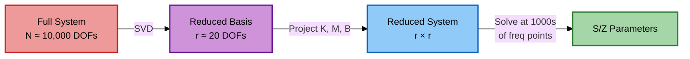
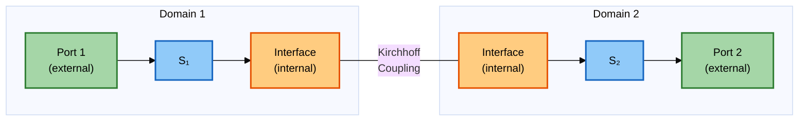

# Mathematical Theory

**cavsim3d** solves the frequency-domain Maxwell's equations using the **Finite Element Method (FEM)** and accelerates wideband analysis through **Model Order Reduction (MOR)**.

---

## 1. Maxwell's Equations

In the frequency domain, assuming an $\exp(j\omega t)$ time dependence:

$$
\nabla \times \mathbf{E} = -j\omega \mu \mathbf{H}
$$

$$
\nabla \times \mathbf{H} = j\omega \varepsilon^* \mathbf{E} + \mathbf{J}_e
$$

where:

- $\omega = 2\pi f$ is the angular frequency
- $\mu$ is the magnetic permeability
- $\varepsilon^* = \varepsilon - j\sigma/\omega$ is the complex permittivity (incorporating conductive losses)
- $\mathbf{J}_e$ is the impressed electric current density

### Vector Wave Equation

Taking the curl of the first equation and substituting yields the second-order equation for $\mathbf{E}$:

$$
\nabla \times \left( \frac{1}{\mu_r} \nabla \times \mathbf{E} \right) - k_0^2 \varepsilon_r^* \mathbf{E} = -j\omega \mu_0 \mathbf{J}_e
$$

where $k_0 = \omega\sqrt{\mu_0\varepsilon_0}$ is the free-space wavenumber. This is the core equation solved by **FrequencyDomainSolver**.

---

## 2. Variational Formulation

To solve numerically via FEM, we multiply by a test function $\mathbf{v} \in H(\text{curl})$ and integrate over the volume $\Omega$:

$$
\int_\Omega \frac{1}{\mu_r} (\nabla \times \mathbf{E}) \cdot (\nabla \times \mathbf{v}) \, \mathrm{d}\Omega
- k_0^2 \int_\Omega \varepsilon_r^* \mathbf{E} \cdot \mathbf{v} \, \mathrm{d}\Omega
+ j\omega\mu_0 \oint_{\partial\Omega} (\mathbf{n} \times \mathbf{H}) \cdot \mathbf{v} \, \mathrm{d}s
= \int_\Omega -j\omega \mu_0 \mathbf{J}_e \, {d}\Omega
$$

The surface integral naturally imposes boundary conditions:

| Boundary | Condition | Effect |
|----------|-----------|--------|
| **PEC** | $\mathbf{n} \times \mathbf{E} = 0$ | Perfect conductor (default for cavity walls) |
| **PMC** | $\mathbf{n} \times \mathbf{H} = 0$ | Perfect magnetic conductor |
| **Port** | Modal expansion | Waveguide interface for S-parameter extraction |

### Discretisation

Expanding $\mathbf{E} \approx \sum_i x_i \mathbf{N}_i$ in the Nédélec (edge) basis leads to the linear system:

$$
\boxed{(\mathbf{K} - \omega^2 \mathbf{M}) \mathbf{x} = \omega \, \mathbf{b}}
$$

where:

- $\mathbf{K}$ = stiffness matrix (from curl-curl term)
- $\mathbf{M}$ = mass matrix (from $\varepsilon$ term)
- $\mathbf{b}$ = right-hand side excitation vector (port modal source, see [Section 3.3](#33-building-the-right-hand-side-b))

!!! info "Notation"
    The system is solved one excitation at a time. For each port-mode pair $(p, m)$, the solver constructs a dedicated RHS vector $\mathbf{b}_{p,m}$ and solves for the corresponding field solution $\mathbf{x}_{p,m}$. The collection of all solutions is assembled into a solution matrix $\mathbf{X} = [\mathbf{x}_1 \mid \mathbf{x}_2 \mid \dots]$.

---

## 3. Port Modal Analysis

At each waveguide port, a 2D eigenvalue problem is solved on the port cross-section to determine the propagating modes.

### 3.1 Port Eigenvalue Problem

The transverse electric field modes $\mathbf{e}_m$ satisfy:

$$
\nabla_t \times (\nabla_t \times \mathbf{e}_m) = k_{c,m}^2 \, \mathbf{e}_m
$$

where $k_{c,m}$ is the cutoff wavenumber of mode $m$ and $\nabla_t$ denotes the transverse (2D) curl operator restricted to the port surface.

!!! tip "Mode sources"
    For standard cross-sections (rectangular, circular), **cavsim3d** uses **analytic mode formulas** for speed and deterministic phase. For arbitrary cross-sections, a **numeric eigenvalue solve** on the port FE space is used instead.

### 3.2 Mode Normalisation

Each port eigenmode is normalised so that the transverse field carries unit energy over the port surface $\Gamma_p$:

$$
\int_{\Gamma_p} |\mathbf{e}_m|^2 \, \mathrm{d}S = 1
$$

In the implementation, the mode grid function is scaled:

$$
\mathbf{e}_m \;\leftarrow\; \frac{\mathbf{e}_m}{\sqrt{\displaystyle\int_{\Gamma_p} |\mathbf{e}_m|^2 \, \mathrm{d}S}}
$$

!!! example "Rectangular waveguide TE modes"
    For a rectangular port with dimensions $a \times b$, the TE$_{mn}$ mode has the analytic form:

    $$
    \mathbf{e}_{mn}(x,y) = E_0 \left[ \frac{m\pi}{a}\cos\!\left(\frac{m\pi x}{a}\right)\sin\!\left(\frac{n\pi y}{b}\right)\hat{\mathbf{x}} + \frac{n\pi}{b}\sin\!\left(\frac{m\pi x}{a}\right)\cos\!\left(\frac{n\pi y}{b}\right)\hat{\mathbf{y}} \right]
    $$

    with $E_0$ chosen so that $\int|\mathbf{e}_{mn}|^2\,\mathrm{d}S = 1$, and cutoff wavenumber $k_{c,mn} = \sqrt{(m\pi/a)^2 + (n\pi/b)^2}$.

### 3.3 Building the Right-Hand Side (b)

The right-hand side vector $\mathbf{b}$ encodes the port modal excitation. For each port $p$ and mode $m$, the excitation is a boundary integral over the port surface:

$$
b_i^{(p,m)} = \int_{\Gamma_p} \mathbf{e}_m \cdot \mathbf{N}_i^{\text{trace}} \, \mathrm{d}S
$$

where $\mathbf{N}_i^{\text{trace}}$ is the trace (tangential restriction) of the $i$-th Nédélec basis function onto the port boundary.

!!! info "Implementation detail"
    In practice, this is computed via the **boundary mass matrix** approach:

    1. Assemble the port boundary mass matrix:

        $$
        (M_{\text{bnd}})_{ij} = \int_{\Gamma_p} \mathbf{N}_i^{\text{trace}} \cdot \mathbf{N}_j^{\text{trace}} \, \mathrm{d}S
        $$

    2. Embed the port mode into the full FE space as a grid function $\mathbf{g}$ with coefficients from $\mathbf{e}_m$.

    3. Compute the weighted vector:

        $$
        \mathbf{b}^{(p,m)} = M_{\text{bnd}} \, \mathbf{g}
        $$

    This mass-weighting ensures that the port mode is correctly projected onto the FE basis, accounting for the mesh geometry at the port.

The solver assembles these vectors for all port-mode pairs and collects them column-wise into the **port basis matrix**:

$$
\mathbf{B} = \bigl[\mathbf{b}^{(1,1)} \mid \mathbf{b}^{(1,2)} \mid \cdots \mid \mathbf{b}^{(P,M)}\bigr] \in \mathbb{R}^{n \times (P \cdot M)}
$$

where $P$ is the number of ports and $M$ the number of modes per port.

### 3.4 Incident Wave Amplitudes and the Frequency Solve

The transverse field at a port is expanded as:

$$
\mathbf{E}_t = \sum_m (a_m + b_m) \mathbf{e}_m
$$

where $a_m$ and $b_m$ are the incident and reflected wave amplitudes for mode $m$.

!!! note "Total-field formulation"
    **cavsim3d** uses a **total-field** approach: there is no explicit decomposition into incident and scattered fields. The solver excites unit incident waves one at a time by constructing the RHS:

    $$
    \mathbf{f}^{(p,m)} = \omega \int_{\Gamma_p} \mathbf{e}_m \cdot \mathbf{v}^{\text{trace}} \, \mathrm{d}S
    $$

    The factor $\omega$ arises from the frequency-dependent coupling. At each frequency $\omega$, the system solved is:

    $$
    (\mathbf{K} - \omega^2 \mathbf{M}) \, \mathbf{x}_{p,m} = \omega \, \mathbf{b}^{(p,m)}
    $$

    The resulting total field $\mathbf{x}_{p,m}$ encodes both the incident excitation and the cavity response. The Z and S-parameters are then extracted directly from this total field (see [Section 4](#4-z-parameter-extraction)).

---

## 4. Z-Parameter Extraction

After solving the linear system for all excitations at a given frequency, the impedance matrix is extracted via a single matrix-vector product:

$$
\boxed{\mathbf{Z}(\omega) = j \, \mathbf{B}^H \mathbf{X}(\omega)}
$$

where $\mathbf{X} = [\mathbf{x}_1 \mid \dots \mid \mathbf{x}_{P \cdot M}]$ is the matrix of solution vectors (one column per excitation) and $\mathbf{B}$ is the port basis matrix.

!!! info "Why this formula works"
    The inner product $\mathbf{B}^H \mathbf{x}$ computes the projection of the total field onto each port mode:

    $$
    (\mathbf{B}^H \mathbf{x})_{p,m} = \sum_i \overline{b_i^{(p,m)}} \, x_i = \int_{\Gamma_p} \overline{\mathbf{e}_m} \cdot \mathbf{E}_t \, \mathrm{d}S
    $$

    This is the **modal voltage** at port $(p,m)$. The factor $j$ accounts for the impedance phase convention consistent with the $\exp(j\omega t)$ time-harmonic assumption.

---

## 5. S-Parameter Extraction

The **Scattering Matrix** relates incident and reflected waves:

$$
\mathbf{b} = \mathbf{S} \, \mathbf{a}
$$

### 5.1 Characteristic (Wave) Impedance

Each port mode has a frequency-dependent characteristic impedance. For TE modes:

$$
Z_{c}(p, m, f) = \frac{\omega_{c,m}}{2\pi f \, \varepsilon_0 \, c_0}
$$

where $\omega_{c,m} = c_0 \, k_{c,m}$ is the cutoff angular frequency and $c_0$ is the speed of light. The reference impedance matrix is:

$$
\mathbf{Z}_0(f) = \text{diag}\bigl(Z_c(1,1,f),\; Z_c(1,2,f),\; \dots,\; Z_c(P,M,f)\bigr)
$$

### 5.2 Z-to-S Conversion

The S-parameters are obtained from the Z-parameters using the standard conversion:

$$
\mathbf{S} = (\mathbf{Z} - \mathbf{Z}_0)(\mathbf{Z} + \mathbf{Z}_0)^{-1}
$$

!!! note "Frequency dependence"
    Because $\mathbf{Z}_0$ depends on frequency through the wave impedance, the Z-to-S conversion is performed at each frequency point individually. Below cutoff ($f < f_{c,m}$), the wave impedance becomes imaginary, indicating an evanescent mode.

### 5.3 The Impedance Matrix (Alternative Form)

The impedance matrix can also be recovered from the S-matrix via:

$$
\mathbf{Z} = \sqrt{\mathbf{Z}_c} \, (\mathbf{I} + \mathbf{S})(\mathbf{I} - \mathbf{S})^{-1} \, \sqrt{\mathbf{Z}_c}
$$

where $\mathbf{Z}_c = \text{diag}(Z_{c,1}, Z_{c,2}, \dots)$ is the diagonal matrix of modal characteristic impedances.

---

## 6. Model Order Reduction (POD)

Solving the full system at every frequency point is expensive. **Proper Orthogonal Decomposition (POD)** creates a compact basis from a few carefully chosen solutions.

### Step-by-Step:

1. **Compute snapshots** at $N_s$ "master" frequencies $\omega_1, \dots, \omega_{N_s}$:

    $$
    \mathbf{X} = [\mathbf{x}(\omega_1), \dots, \mathbf{x}(\omega_{N_s})]
    $$

2. **SVD** of the snapshot matrix:

    $$
    \mathbf{X} = \mathbf{U} \mathbf{\Sigma} \mathbf{W}^H
    $$

3. **Truncate** at rank $r$ where $\sigma_r / \sigma_1 > \text{tol}$:

    $$
    \mathbf{V} = \mathbf{U}_{:, 1:r}
    $$

4. **Project** the system onto the reduced basis:

    $$
    \underbrace{\mathbf{V}^H \mathbf{K} \mathbf{V}}_{\tilde{\mathbf{K}} \in \mathbb{R}^{r \times r}} \tilde{\mathbf{x}} - \omega^2 \underbrace{\mathbf{V}^H \mathbf{M} \mathbf{V}}_{\tilde{\mathbf{M}}} \tilde{\mathbf{x}} = \underbrace{\mathbf{V}^H \mathbf{B}}_{\tilde{\mathbf{B}}} \mathbf{a}
    $$

5. **Solve** the $r \times r$ system at each frequency (milliseconds).

!!! tip "Mass-weighted spectral transformation"
    For improved spectral accuracy, cavsim3d applies a mass-weighted transformation to the reduced system:

    1. Eigendecompose the reduced mass matrix: $\tilde{\mathbf{M}} = \mathbf{Q} \mathbf{\Lambda} \mathbf{Q}^T$
    2. Compute $\mathbf{Q}_L^{-1} = \mathbf{Q} \mathbf{\Lambda}^{-1/2}$
    3. Transform: $\hat{\mathbf{K}} = (\mathbf{Q}_L^{-1})^T \tilde{\mathbf{K}} \, \mathbf{Q}_L^{-1}$, $\quad \hat{\mathbf{B}} = (\mathbf{Q}_L^{-1})^T \tilde{\mathbf{B}}$
    4. The reduced system becomes $(\hat{\mathbf{K}} - \omega^2 \mathbf{I})\hat{\mathbf{x}} = \omega \hat{\mathbf{B}} \mathbf{a}$

    The eigenvalues of $\hat{\mathbf{K}}$ directly give the squared resonant frequencies $\omega_r^2$.

---

## 7. Concatenation Theory

For multi-domain structures, per-domain S-matrices are cascaded via **Kirchhoff coupling** at shared interfaces.

### Kirchhoff Conditions at Internal Ports

At the interface between domains $d$ and $d+1$:

$$
\mathbf{a}_{\text{int}}^{(d)} = \mathbf{b}_{\text{int}}^{(d+1)}, \qquad
\mathbf{b}_{\text{int}}^{(d)} = \mathbf{a}_{\text{int}}^{(d+1)}
$$

This enforces continuity of tangential electric and magnetic fields across the shared port.

!!! info "Physical interpretation"
    The Kirchhoff coupling states that what exits one domain as a reflected wave enters the adjacent domain as an incident wave, and vice versa. This is the S-parameter analogue of enforcing field continuity at an interface.

### Global System Assembly

Given per-domain S-matrices $\mathbf{S}_1, \mathbf{S}_2, \dots$, the concatenation assembles a block system that enforces the coupling constraints and eliminates the internal port variables, yielding the global S-matrix relating only the external ports:

$$
\mathbf{b}_{\text{ext}} = \mathbf{S}_{\text{global}} \, \mathbf{a}_{\text{ext}}
$$

The internal port DOFs are eliminated, leaving a 2-port global system.

---

## Summary of the Solve Pipeline

The following table summarises the key mathematical objects and where they appear in the pipeline:

| Object | Symbol | Size | Description |
|--------|--------|------|-------------|
| Stiffness matrix | $\mathbf{K}$ | $n \times n$ | Curl-curl bilinear form: $\int \frac{1}{\mu_r}(\nabla \times \mathbf{N}_i) \cdot (\nabla \times \mathbf{N}_j) \,\mathrm{d}\Omega$ |
| Mass matrix | $\mathbf{M}$ | $n \times n$ | $\varepsilon$-weighted inner product: $\int \varepsilon_0 \, \mathbf{N}_i \cdot \mathbf{N}_j \,\mathrm{d}\Omega$ |
| Port basis matrix | $\mathbf{B}$ | $n \times PM$ | Boundary mass-weighted port modes (see [Section 3.3](#33-building-the-right-hand-side-b)) |
| Solution vector | $\mathbf{x}$ | $n$ | FE coefficients of total electric field |
| Z-parameters | $\mathbf{Z}$ | $PM \times PM$ | Impedance matrix: $j\mathbf{B}^H\mathbf{X}$ |
| S-parameters | $\mathbf{S}$ | $PM \times PM$ | Scattering matrix: $(\mathbf{Z}-\mathbf{Z}_0)(\mathbf{Z}+\mathbf{Z}_0)^{-1}$ |
| POD basis | $\mathbf{V}$ | $n \times r$ | Truncated left singular vectors of snapshot matrix |
| Reduced system | $\tilde{\mathbf{K}}, \tilde{\mathbf{M}}$ | $r \times r$ | Galerkin-projected matrices ($r \ll n$) |
