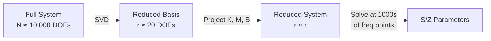
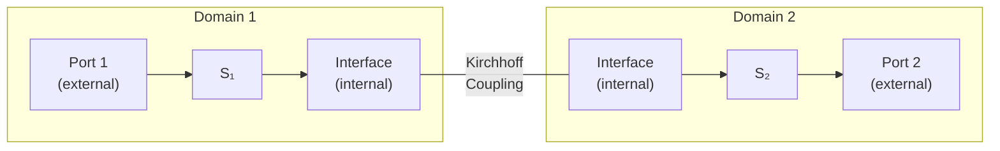

# Mathematical Theory

**cavsim3d** solves the frequency-domain Maxwell's equations using the **Finite Element Method (FEM)** and accelerates wideband analysis through **Model Order Reduction (MOR)**.

---

## 1. Maxwell's Equations

In the frequency domain, assuming an $\exp(j\omega t)$ time dependence:

$$
\nabla \times \mathbf{E} = -j\omega \mu \mathbf{H}
$$

$$
\nabla \times \mathbf{H} = j\omega \varepsilon^* \mathbf{E} + \mathbf{J}_e
$$

where:

- $\omega = 2\pi f$ is the angular frequency
- $\mu$ is the magnetic permeability
- $\varepsilon^* = \varepsilon - j\sigma/\omega$ is the complex permittivity (incorporating conductive losses)
- $\mathbf{J}_e$ is the impressed electric current density

### Vector Wave Equation

Taking the curl of the first equation and substituting yields the second-order equation for $\mathbf{E}$:

$$
\nabla \times \left( \frac{1}{\mu_r} \nabla \times \mathbf{E} \right) - k_0^2 \varepsilon_r^* \mathbf{E} = -j\omega \mu_0 \mathbf{J}_e
$$

where $k_0 = \omega\sqrt{\mu_0\varepsilon_0}$ is the free-space wavenumber. This is the core equation solved by **FrequencyDomainSolver**.

---

## 2. Variational Formulation

To solve numerically via FEM, we multiply by a test function $\mathbf{v} \in H(\text{curl})$ and integrate over the volume $\Omega$:

$$
\int_\Omega \frac{1}{\mu_r} (\nabla \times \mathbf{E}) \cdot (\nabla \times \mathbf{v}) \, \mathrm{d}\Omega
- k_0^2 \int_\Omega \varepsilon_r^* \mathbf{E} \cdot \mathbf{v} \, \mathrm{d}\Omega
+ j\omega\mu_0 \oint_{\partial\Omega} (\mathbf{n} \times \mathbf{H}) \cdot \mathbf{v} \, \mathrm{d}s
= \int_\Omega -j\omega \mu_0 \mathbf{J}_e \, {d}\Omega
$$

The surface integral naturally imposes boundary conditions:

| Boundary | Condition | Effect |
|----------|-----------|--------|
| **PEC** | $\mathbf{n} \times \mathbf{E} = 0$ | Perfect conductor (default for cavity walls) |
| **PMC** | $\mathbf{n} \times \mathbf{H} = 0$ | Perfect magnetic conductor |
| **Port** | Modal expansion | Waveguide interface for S-parameter extraction |

### Discretisation

Expanding $\mathbf{E} \approx \sum_i x_i \mathbf{N}_i$ in the Nédélec (edge) basis leads to the linear system:

$$
(\mathbf{K} - \omega^2 \mathbf{M}) \mathbf{x} = \mathbf{B} \mathbf{a}
$$

where:

- $\mathbf{K}$ = stiffness matrix (from curl-curl term)
- $\mathbf{M}$ = mass matrix (from $\varepsilon$ term)
- $\mathbf{B}$ = port excitation matrix
- $\mathbf{a}$ = incident wave amplitudes

---

## 3. Port Modal Analysis

At each waveguide port, we solve a 2D eigenvalue problem to find the propagating modes $\mathbf{e}_m$:

$$
\nabla_t \times (\nabla_t \times \mathbf{e}_m) = \gamma_m^2 \mathbf{e}_m
$$

The transverse field at a port is expanded as:

$$
\mathbf{E}_t = \sum_m (a_m + b_m) \mathbf{e}_m
$$

where $a_m$ and $b_m$ are the incident and reflected wave amplitudes for mode $m$.

---

## 4. S and Z-Parameter Extraction

The **Scattering Matrix** relates incident and reflected waves:

$$
\mathbf{b} = \mathbf{S} \mathbf{a}
$$

The **Impedance Matrix** relates modal voltages and currents:

$$
\mathbf{Z} = \sqrt{\mathbf{Z}_c} \, (\mathbf{I} + \mathbf{S})(\mathbf{I} - \mathbf{S})^{-1} \, \sqrt{\mathbf{Z}_c}
$$

where $\mathbf{Z}_c = \text{diag}(Z_{c,1}, Z_{c,2}, \dots)$ is the diagonal matrix of modal characteristic impedances.

---

## 5. Model Order Reduction (POD)

Solving the full system at every frequency point is expensive. **Proper Orthogonal Decomposition (POD)** creates a compact basis from a few carefully chosen solutions.

### Step-by-Step:

1. **Compute snapshots** at $N_s$ "master" frequencies $\omega_1, \dots, \omega_{N_s}$:

    $$
    \mathbf{X} = [\mathbf{x}(\omega_1), \dots, \mathbf{x}(\omega_{N_s})]
    $$

2. **SVD** of the snapshot matrix:

    $$
    \mathbf{X} = \mathbf{U} \mathbf{\Sigma} \mathbf{W}^H
    $$

3. **Truncate** at rank $r$ where $\sigma_r / \sigma_1 > \text{tol}$:

    $$
    \mathbf{V} = \mathbf{U}_{:, 1:r}
    $$

4. **Project** the system onto the reduced basis:

    $$
    \underbrace{\mathbf{V}^H \mathbf{K} \mathbf{V}}_{\tilde{\mathbf{K}} \in \mathbb{R}^{r \times r}} \tilde{\mathbf{x}} - \omega^2 \underbrace{\mathbf{V}^H \mathbf{M} \mathbf{V}}_{\tilde{\mathbf{M}}} \tilde{\mathbf{x}} = \underbrace{\mathbf{V}^H \mathbf{B}}_{\tilde{\mathbf{B}}} \mathbf{a}
    $$

5. **Solve** the $r \times r$ system at each frequency (milliseconds).

---

## 6. Concatenation Theory

For multi-domain structures, per-domain S-matrices are cascaded via **Kirchhoff coupling** at shared interfaces.

### Kirchhoff Conditions at Internal Ports

At the interface between domains $d$ and $d+1$:

$$
\mathbf{a}_{\text{int}}^{(d)} = \mathbf{b}_{\text{int}}^{(d+1)}, \qquad
\mathbf{b}_{\text{int}}^{(d)} = \mathbf{a}_{\text{int}}^{(d+1)}
$$

This enforces continuity of tangential electric and magnetic fields across the shared port.

### Global System Assembly

Given per-domain S-matrices $\mathbf{S}_1, \mathbf{S}_2, \dots$, the concatenation assembles a block system that enforces the coupling constraints and eliminates the internal port variables, yielding the global S-matrix relating only the external ports:

$$
\mathbf{b}_{\text{ext}} = \mathbf{S}_{\text{global}} \, \mathbf{a}_{\text{ext}}
$$

The internal port DOFs are eliminated, leaving a 2-port global system.
