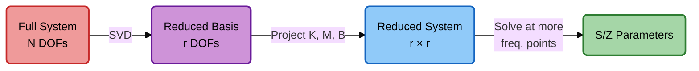
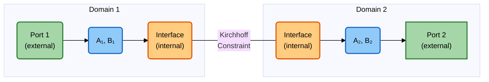
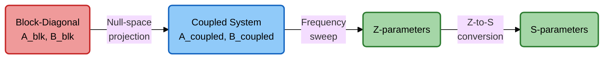

# Mathematical Theory

**cavsim3d** solves the frequency-domain Maxwell's equations using the **Finite Element Method (FEM)** and accelerates wideband analysis through **Model Order Reduction (MOR)**.

---

## 1. Maxwell's Equations

In the frequency domain, assuming an $e^{j\omega t}$ time dependence:

$$
\nabla \times \mathbf{E} = -j\omega \mu \mathbf{H}
$$

$$
\nabla \times \mathbf{H} = j\omega \varepsilon \mathbf{E}
$$

where:

- $\omega = 2\pi f$ is the angular frequency
- $\mu$ is the magnetic permeability
- $\varepsilon$ is the permittivity

### Vector Wave Equation

Taking the curl of the first equation and substituting yields the second-order equation for $\mathbf{E}$:

$$
\nabla \times \left( \frac{1}{\mu_r} \nabla \times \mathbf{E} \right) - k_0^2 \varepsilon_r \mathbf{E} = \mathbf{0}
$$

where $k_0 = \omega\sqrt{\mu_0\varepsilon_0}$ is the free-space wavenumber. This is the core equation solved by **FrequencyDomainSolver**.

---

## 2. Variational Formulation

To solve numerically via FEM, we multiply by a test function $\mathbf{v} \in H(\text{curl})$ and integrate over the volume $\Omega$:

$$
\int_\Omega \frac{1}{\mu_r} (\nabla \times \mathbf{E}) \cdot (\nabla \times \mathbf{v}) \, \mathrm{d}\Omega
- k_0^2 \int_\Omega \varepsilon_r \mathbf{E} \cdot \mathbf{v} \, \mathrm{d}\Omega
- j\omega\mu_0 \oint_{\partial\Omega} (\mathbf{n} \times \mathbf{H}) \cdot \mathbf{v} \, \mathrm{d}S
= 0
$$

The boundary conditions are applied using the surface integral term:

| Boundary | Condition | Effect |
|----------|-----------|--------|
| **PEC** | $\mathbf{n} \times \mathbf{E} = 0$ | Perfect conductor (default for cavity walls) |
| **PMC** | $\mathbf{n} \times \mathbf{H} = 0$ | Perfect magnetic conductor |
| **Port** | Modal expansion | Waveguide interface for S-parameter extraction |

!!! info "Implementation detail"
    PMC boundary condition is applied on the port faces not an absorbing boundary condition like PML.

### Discretisation

We expand the electric field in terms of Nédélec (edge) basis functions:

$$
\mathbf{E} \approx \sum_{i} x_i \mathbf{N}_i
$$

and choose the test function $\mathbf{v} = \mathbf{N}_j$ (Galerkin method) for each degree of freedom $j$.
Substituting into the variational form:

$$
\int_\Omega \frac{1}{\mu_r}
  \left(\nabla \times \sum_{i} x_i \mathbf{N}_i\right)
  \cdot (\nabla \times \mathbf{N}_j) \, \mathrm{d}\Omega
\;-\; k_0^2 \int_\Omega \varepsilon_r
  \left(\sum_{i} x_i \mathbf{N}_i\right)
  \cdot \mathbf{N}_j \, \mathrm{d}\Omega
\;-\; j\omega\mu_0 \oint_{\partial\Omega}
  (\mathbf{n} \times \mathbf{H}) \cdot \mathbf{N}_j \, \mathrm{d}S
= 0
$$

We now treat each term separately.

---

#### Term 1 — Stiffness (Curl–Curl)

Using linearity of the curl operator, pull the sum and coefficients out of the integral:

$$
\int_\Omega \frac{1}{\mu_r}
  \left(\sum_i x_i \,\nabla \times \mathbf{N}_i\right)
  \cdot (\nabla \times \mathbf{N}_j) \, \mathrm{d}\Omega
\;=\;
\sum_i x_i
  \underbrace{
    \int_\Omega \frac{1}{\mu_r}
    (\nabla \times \mathbf{N}_i) \cdot (\nabla \times \mathbf{N}_j)
    \, \mathrm{d}\Omega
  }_{K_{ji}}
$$

Define the **stiffness matrix**:

$$
\boxed{
  K_{ji} = \int_\Omega \frac{1}{\mu_r}\,
  (\nabla \times \mathbf{N}_i) \cdot (\nabla \times \mathbf{N}_j)
  \, \mathrm{d}\Omega
}
$$

!!! note "Regularisation"
    The curl–curl operator has a large null space (gradient fields, $\nabla \times \nabla
    \phi = \mathbf{0}$), so $\mathbf{K}$ on its own is singular. The assembly therefore adds
    a small multiple of the same-weighted mass term,

    $$
      K_{ji} \;\rightarrow\; K_{ji} + \epsilon_{\text{reg}} \int_\Omega \frac{1}{\mu_r}\,
      \mathbf{N}_i \cdot \mathbf{N}_j \, \mathrm{d}\Omega,
      \qquad \epsilon_{\text{reg}} = 10^{-8},
    $$

    which shifts those null modes away from zero without measurably perturbing the
    propagating solution.

So Term 1 becomes $\displaystyle\sum_i K_{ji}\, x_i$.

---

#### Term 2 — Mass

Similarly, expand and factor:

$$
k_0^2 \int_\Omega \varepsilon_r
  \left(\sum_i x_i \,\mathbf{N}_i\right) \cdot \mathbf{N}_j
  \, \mathrm{d}\Omega
\;=\;
k_0^2 \sum_i x_i
  \underbrace{
    \int_\Omega \varepsilon_r \,
    \mathbf{N}_i \cdot \mathbf{N}_j
    \, \mathrm{d}\Omega
  }_{M_{ji}'}
$$

Since $k_0 = \omega\sqrt{\mu_0 \varepsilon_0}$, we have
$k_0^2 = \omega^2 \mu_0 \varepsilon_0$. Absorbing the physical
constants into the matrix, define the **mass matrix**:

$$
\boxed{
  M_{ji} = \mu_0 \varepsilon_0
  \int_\Omega \varepsilon_r \,
  \mathbf{N}_i \cdot \mathbf{N}_j
  \, \mathrm{d}\Omega
}
$$

So Term 2 becomes $\displaystyle -\omega^2 \sum_i M_{ji}\, x_i$.

---

#### Term 3 — Boundary Conditions

#### PEC Boundary

Starting from the surface integral:

$$
-j\omega\mu_0 \oint_{\partial\Omega}
(\mathbf{n} \times \mathbf{H}) \cdot \mathbf{v}
\,\mathrm{d}S
\;=\;
- j\omega\mu_0 \oint_{\partial\Omega}
\mathbf{H} \cdot (\mathbf{n} \times \mathbf{v})
\,\mathrm{d}S
$$

On PEC walls, $\mathbf{n} \times \mathbf{E} = 0$ is
an **essential (Dirichlet) boundary condition**, enforced
by constraining the edge degrees of freedom. Since the
test functions live in the same constrained space, they
must also satisfy:

$$
\mathbf{n} \times \mathbf{v}\big|_{\partial\Omega_{\text{PEC}}} = 0
$$

Therefore:

$$
j\omega\mu_0 \oint_{\partial\Omega_{\text{PEC}}}
\mathbf{H} \cdot
\underbrace{(\mathbf{n} \times \mathbf{v})}_{=\,0}
\,\mathrm{d}S = 0
$$

#### PMC Boundary

For PMC, the tangential magnetic field vanishes:
$\mathbf{n} \times \mathbf{H} = 0$.
This is a **natural (Neumann) boundary condition** — the
surface integral vanishes directly without constraining
any degrees of freedom:

$$
-j\omega\mu_0
\oint_{\partial\Omega_{\text{PMC}}}
\underbrace{(\mathbf{n} \times \mathbf{H})}_{= \,0}
\cdot \mathbf{v}\,\mathrm{d}S \;=\; 0
$$

No special treatment is needed: simply not imposing any
boundary condition on a surface automatically enforces PMC.                                                                               

#### Source / Port Excitation
The surface integral does not depend on the unknown
coefficients $x_i$. The field in the integral is the
incident field (subscript inc) from the port. Factor out $\omega$:

$$
-j\omega\mu_0 \oint_{\partial\Omega_\mathrm{port}}
  (\mathbf{n} \times \mathbf{H}_\mathrm{inc}) \cdot \mathbf{N}_j \, \mathrm{d}S
\;=\;
-j\omega
\underbrace{
  \left(
    \mu_0 \oint_{\partial\Omega_\mathrm{port}}
    (\mathbf{n} \times \mathbf{H}_\mathrm{inc}) \cdot \mathbf{N}_j
    \, \mathrm{d}S
  \right)
}_{b_j}
$$

Define the **excitation vector**:

$$
\boxed{
  b_j = \mu_0 \oint_{\partial\Omega_\mathrm{port}}
  (\mathbf{n} \times \mathbf{H}_\mathrm{inc}) \cdot \mathbf{N}_j
  \, \mathrm{d}S
}
$$

So Term 3 is $-j\omega\, b_j$, which moves to the right-hand side as $+j\omega\, b_j$.

---

#### Assembly into Matrix Form

Collecting all three terms for each test function index $j$:

$$
\sum_i K_{ji}\, x_i
\;-\; \omega^2 \sum_i M_{ji}\, x_i
\;=\; j\omega\, b_j
$$

Recognising the sums as matrix–vector products:

$$
\boxed{
  \left(\mathbf{K} - \omega^2\,\mathbf{M}\right)\mathbf{x}
  = j\omega\,\mathbf{b}
}
$$

where:

| Symbol | Size | Definition |
|--------|------|------------|
| $\mathbf{K}$ | $n \times n$ | Stiffness (curl–curl) matrix |
| $\mathbf{M}$ | $n \times n$ | Mass matrix (with $\mu_0\varepsilon_0$ absorbed) |
| $\mathbf{x}$ | $n \times 1$ | Unknown edge-element coefficients |
| $\mathbf{b}$ | $n \times 1$ | Port excitation vector |
| $n$           | —    | Number of degrees of freedom |

!!! info "Notation"
    The system is solved one excitation at a time. For each port-mode pair $(p, m)$, the solver constructs a dedicated RHS vector $\mathbf{b}_{p,m}$ assembled in the excitation matrix $\mathbf{B}$ and solves for the corresponding field solution $\mathbf{x}_{p,m}$. The collection of all solutions is assembled into a solution matrix $\mathbf{X} = [\mathbf{x}_{1,1} \mid \mathbf{x}_{1,2} \mid \dots \mid \mathbf{x}_{p,m}]$.

---

## 3. Port Modal Analysis

At each waveguide port, a 2D eigenvalue problem is solved on the port
cross-section to determine the propagating modes.

### 3.1 Port Eigenvalue Problem

The transverse electric field modes $\mathbf{e}_m$ satisfy:

$$
\nabla_t \times (\nabla_t \times \mathbf{e}_m)
= k_{c,m}^2 \, \mathbf{e}_m
$$

where $k_{c,m}$ is the cutoff wavenumber of mode $m$ and $\nabla_t$
denotes the transverse (2D) curl operator restricted to the port surface.

!!! tip "Mode sources"
    For standard cross-sections (rectangular, circular), **cavsim3d**
    uses **analytic mode formulas** (for external ports) for speed and
    deterministic phase. For internal ports and arbitrary cross-sections,
    a **numeric eigenvalue solve** on the port FE space is used instead.
    The default setting is using analytical mode formulas for all external
    ports and numerical mode solver for all internal ports. This can be
    changed by setting the `mode_source` and `mode_source_internal` flags
    to `'analytic'` or `'numeric'`.

#### Port Eigenmode Expansion

The port eigenmodes are computed on the 2D port surface $\Gamma_p$
using the **same Nédélec basis functions** as the 3D domain, but
restricted (traced) to the port boundary. Specifically, the $m$-th
port eigenmode field is expanded as:

$$
\mathbf{e}_m = \sum_i (\hat{e}_m)_i \, \mathbf{N}_i^{\text{trace}}
$$

where $(\hat{e}_m)_i$ are the expansion coefficients forming the
discrete eigenvector
$\hat{\mathbf{e}}_m \in \mathbb{R}^{n_p}$, and
$\mathbf{N}_i^{\text{trace}}$ is the tangential trace of the $i$-th
Nédélec edge basis function onto the port surface
$\partial\Omega_{\text{port}}$. Here $n_p$ is the number of edge
degrees of freedom on the port.

!!! note "Notation"
    Throughout this section we distinguish between:

    - $\mathbf{e}_m$ — the **continuous mode field** (a function on
      the port surface)
    - $\hat{\mathbf{e}}_m$ — the **discrete coefficient vector**
      (the eigenvector in $\mathbb{R}^{n_p}$)

    They are related by
    $\mathbf{e}_m = \sum_i (\hat{e}_m)_i \,
    \mathbf{N}_i^{\text{trace}}$.

These eigenvectors are obtained by solving the 2D eigenvalue
problem on $\partial\Omega_{\text{port}}$:

$$
\int_{\partial\Omega_{\text{port}}}
(\nabla_t \times \mathbf{e}_m) \cdot
(\nabla_t \times \mathbf{N}_j^{\text{trace}})
\,\mathrm{d}S
= k_{c,m}^2
\int_{\partial\Omega_{\text{port}}}
\mathbf{e}_m \cdot \mathbf{N}_j^{\text{trace}}
\,\mathrm{d}S
$$

which in matrix form reads:

$$
\mathbf{K}_{\text{port}}\,\hat{\mathbf{e}}_m
= k_{c,m}^2\,\mathbf{M}_{\text{port}}\,\hat{\mathbf{e}}_m
$$

where:

$$
(K_{\text{port}})_{ji}
= \int_{\partial\Omega_{\text{port}}}
  (\nabla_t \times \mathbf{N}_i^{\text{trace}})
  \cdot
  (\nabla_t \times \mathbf{N}_j^{\text{trace}})
  \,\mathrm{d}S,
\quad
(M_{\text{port}})_{ji}
= \int_{\partial\Omega_{\text{port}}}
  \mathbf{N}_i^{\text{trace}}
  \cdot
  \mathbf{N}_j^{\text{trace}}
  \,\mathrm{d}S
$$

and $k_{c,m}$ is the cutoff wavenumber of the $m$-th mode.

!!! info "Why the same basis?"
    Using the trace of the 3D Nédélec basis on the port
    — rather than an independent 2D basis — ensures that
    the coefficient vector $\hat{\mathbf{e}}_m$ lives directly
    in the same discrete space as the 3D field $\mathbf{E}$.
    This means the port mode can be embedded into the full
    finite-element vector without any interpolation or
    projection error: the coefficients $(\hat{e}_m)_i$ simply
    slot into the corresponding global DOFs on the port face.

### 3.2 Building the Right-Hand Side (b)

The right-hand side vector $\mathbf{b}$ encodes the port modal
excitation. For each port $p$ and mode $m$, the excitation is a
boundary integral over the port surface.

Starting from the boundary integral for the $j$-th component of the
right-hand side vector:

$$
b_{j,p,m} = \int_{\partial\Omega_{\text{port}}}
\mathbf{e}_{p,m} \cdot \mathbf{N}_j^{\text{trace}}
\,\mathrm{d}S
$$

Substitute the basis expansion
$\mathbf{e}_{p,m} = \sum_i (\hat{e}_{p,m})_i \,
\mathbf{N}_i^{\text{trace}}$:

$$
b_{j,p,m} = \int_{\partial\Omega_{\text{port}}}
\left(\sum_i (\hat{e}_{p,m})_i \,
\mathbf{N}_i^{\text{trace}}\right)
\cdot \mathbf{N}_j^{\text{trace}}
\,\mathrm{d}S
$$

Pull the sum and coefficients out of the integral:

$$
 b_{j,p,m} = \sum_i (\hat{e}_{p,m})_i
\underbrace{
  \int_{\partial\Omega_{\text{port}}}
  \mathbf{N}_i^{\text{trace}} \cdot \mathbf{N}_j^{\text{trace}}
  \,\mathrm{d}S
}_{(M_{\text{port}})_{ji}}
$$

This reveals the **port boundary mass matrix**:

$$
(M_{\text{port}})_{ji} = \int_{\partial\Omega_{\text{port}}}
\mathbf{N}_i^{\text{trace}} \cdot \mathbf{N}_j^{\text{trace}}
\,\mathrm{d}S
$$

Recognising the sum as a matrix–vector product, the full
right-hand side vector for port $p$, mode $m$ is:

$$
\mathbf{b}_{p,m} = M_{\text{port}} \, \hat{\mathbf{e}}_{p,m}
$$

where $\hat{\mathbf{e}}_{p,m} \in \mathbb{R}^{n_p}$ is the discrete
eigenvector of the port eigenvalue problem, containing the
coefficients $(\hat{e}_{p,m})_i$.

!!! info "Normalisation"
    The mode field vector $\hat{\mathbf{e}}_m$ is normalised to have
    **unit amplitude** on the port surface:

    $$
    \sqrt{\langle\hat{\mathbf{e}}_m,\hat{\mathbf{e}}_m\rangle} = 1
    $$
    
    $$
    \hat{\mathbf{e}}_m \leftarrow
        \frac{\hat{\mathbf{e}}_m}{
        \sqrt{\langle\hat{\mathbf{e}}_m,\hat{\mathbf{e}}_m\rangle}
        }
    $$

The solver assembles these vectors for all port-mode pairs and
collects them column-wise into the **port basis matrix**:

$$
\mathbf{B} = \bigl[\mathbf{b}_{1,1} \mid \mathbf{b}_{1,2} \mid \cdots \mid \mathbf{b}_{p,m}\bigr] \in \mathbb{R}^{n \times (p \cdot m)}
$$

where $p$ is the number of ports and $m$ the number of modes per port. The general equation therefore for multiple ports and multiple modes per port is:

$$
  \left(\mathbf{K} - \omega^2\,\mathbf{M}\right)\mathbf{X}
  = j\omega\,\mathbf{B}
$$

!!! note "Where the $j$ goes"
    The solver factors the constant $j$ out of the right-hand side, solving

    $$
      \left(\mathbf{K} - \omega^2\,\mathbf{M}\right)\mathbf{X} = \omega\,\mathbf{B}
    $$

    and reinstating it during the Z-extraction of [Section 4](#4-z-parameter-extraction).
    This keeps $\mathbf{K}$, $\mathbf{M}$, $\mathbf{B}$ and $\mathbf{X}$ real for a lossless
    structure, which is what makes the POD basis of [Section 6](#6-model-order-reduction-pod)
    real as well. Every subsequent section carries the $\omega\,\mathbf{B}$ form.

---

## 4. Z-Parameter Extraction

After solving the linear system for all excitations at a given frequency, the impedance matrix is extracted via a single matrix-vector product:

$$
\mathbf{Z}(\omega) = j \, \mathbf{B}^H \mathbf{X}(\omega)
$$

where $\mathbf{X} = [\mathbf{x}_{1,1} \mid \dots \mid \mathbf{x}_{p,m}]$ is the matrix of solution vectors (one column per excitation) and $\mathbf{B}$ is the port basis matrix.

## 5. Z/S-Parameter Extraction

### 5.1 Characteristic (Wave) Impedance
Each port mode has a frequency-dependent characteristic impedance. For TE modes:

$$ Z_\mathrm{TE} = \frac{\eta}{\sqrt{1 - \left( \frac{f_{c,m}}{f} \right)^2}} $$
for TM modes:

$$ Z_\mathrm{TM} = \eta \sqrt{1 - \left( \frac{f_{c,m}}{f} \right)^2} $$

and for TEM modes:

$$ Z_\mathrm{TEM} = \eta $$
where $f_{c,m}$ is the cutoff frequency for the $m$-th mode at port $p$. The reference impedance matrix is:

$$ \mathbf{Z}_{\mathrm{ref}} = \begin{bmatrix} 
Z_{\mathrm{ref},1,1} & 0 & \dots & 0 \\ 
0 & Z_{\mathrm{ref},1,2} & \dots & 0 \\ 
\vdots & \vdots & \ddots & \vdots \\ 
0 & 0 & \dots & Z_{\mathrm{ref},p,m} 
\end{bmatrix} $$

where $Z_{\mathrm{ref},i,j}$ is the characteristic impedance of the $i$-th port and $j$-th mode. It could be a TE, TM, or TEM mode.

### 5.2 Z-to-S Conversion
The S-parameters are obtained from the Z-parameters using the generalised **pseudo-wave**
conversion (Marks & Williams) -- the convention used by CST and HFSS for multimode
S-parameters. Unlike Kurokawa power-waves it does not require $\mathrm{Re}(Z_0) > 0$, so it
stays valid for the purely reactive $Z_0$ of a mode below cutoff:

$$ \mathbf{S} = \mathbf{Z}_{\mathrm{ref}}^{-1/2} (\mathbf{Z} - \mathbf{Z}_{\mathrm{ref}})(\mathbf{Z} + \mathbf{Z}_{\mathrm{ref}})^{-1} \mathbf{Z}_{\mathrm{ref}}^{1/2} $$

### 5.3 The Impedance Matrix (Recovery)
The impedance matrix can be recovered from the S-matrix via:

$$ \mathbf{Z} = \mathbf{Z}_{\mathrm{ref}}^{1/2} (\mathbf{I} + \mathbf{S})(\mathbf{I} - \mathbf{S})^{-1} \mathbf{Z}_{\mathrm{ref}}^{1/2} $$

---

## 6. Model Order Reduction (POD)

Solving the full system at every frequency point is expensive. **Proper Orthogonal Decomposition (POD)** creates a compact basis from a few sampled solutions.

### Step-by-Step:

1. **Compute snapshots** at $N_s$ "master" frequencies $\omega_1, \dots, \omega_{N_s}$:

    $$
    \mathbf{X} = [\mathbf{x}(\omega_1), \dots, \mathbf{x}(\omega_{N_s})]
    $$

2. **Singular Value Decomposition (SVD)** of the snapshot matrix:

    $$
    \mathbf{X} = \mathbf{U} \mathbf{\Sigma} \mathbf{W}^H
    $$

3. **Truncate** at rank $r$ where $\sigma_r / \sigma_1 > \text{tol}$:

    $$
    \mathbf{V} = \mathbf{U}_{:, 1:r}
    $$

4. **Project** the system onto the reduced basis:

    $$
    \underbrace{\mathbf{V}^H \mathbf{K} \mathbf{V}}_{\tilde{\mathbf{K}} \in \mathbb{R}^{r \times r}} \hat{\mathbf{X}} - \omega^2 \underbrace{\mathbf{V}^H \mathbf{M} \mathbf{V}}_{\tilde{\mathbf{M}} \in \mathbb{R}^{r \times r}} \hat{\mathbf{X}} = j\omega \underbrace{\mathbf{V}^H \mathbf{B}}_{\tilde{\mathbf{B}} \in \mathbb{R}^{r \times p \cdot m}}
    $$

    where $\mathbf{X} = \mathbf{V}\hat{\mathbf{X}}$, $\hat{\mathbf{X}} \in \mathbb{R}^{r \times p \cdot m}$.

5. **Solve** the $r \times r$ system at each frequency (milliseconds).

!!! tip "Mass-weighted spectral transformation"

    1. Eigendecompose the reduced mass matrix: $\tilde{\mathbf{M}} = \mathbf{Q} \mathbf{\Lambda} \mathbf{Q}^T$
    2. Compute $\mathbf{Q}_L^{-1} = \mathbf{Q} \mathbf{\Lambda}^{-1/2}$
    3. Transform: $\hat{\mathbf{A}} = (\mathbf{Q}_L^{-1})^T \tilde{\mathbf{K}} \, \mathbf{Q}_L^{-1}$, $\quad \hat{\mathbf{B}} = (\mathbf{Q}_L^{-1})^T \tilde{\mathbf{B}}$
    4. The reduced system becomes $(\hat{\mathbf{A}} - \omega_r^2 \mathbf{I})\hat{\mathbf{X}} = \omega_r \hat{\mathbf{B}}$

    The eigenvalues of ${\hat{\mathbf{A}}}$ directly give the squared resonant frequencies $\omega_r^2$.

```mermaid
%%{init: {'theme': 'base', 'themeVariables': {'fontSize': '14px'}}}%%
graph LR
    A("Full System<br/>N DOFs"):::full -->|"SVD"| B("Reduced Basis<br/>r DOFs"):::basis
    B -->|"Project K, M, B"| C("Reduced System<br/>r × r"):::reduced
    C -->|"Solve at more<br/>freq. points"| D("S/Z Parameters"):::result
    classDef full fill:#ef9a9a,stroke:#c62828,stroke-width:2px,color:#000
    classDef basis fill:#ce93d8,stroke:#6a1b9a,stroke-width:2px,color:#000
    classDef reduced fill:#90caf9,stroke:#1565c0,stroke-width:2px,color:#000
    classDef result fill:#a5d6a7,stroke:#2e7d32,stroke-width:2px,color:#000
```

---

## 7. Concatenation

For multi-domain structures, the per-domain **system matrices** ($\hat{\mathbf{A}}_d, \hat{\mathbf{B}}_d$) are concatenated into a single coupled system via **Kirchhoff constraints** at shared interfaces. The coupled system is then solved directly for the global Z-parameters, from which the S-parameters are derived.

!!! note "System-level coupling, not S-parameter cascading"
    The concatenation operates on the reduced system matrices, **not** on S-parameters. The per-domain matrices $\hat{\mathbf{A}}_d$ and $\hat{\mathbf{B}}_d$ are assembled into a block-diagonal system and then projected onto a constraint-satisfying subspace that enforces field continuity at internal ports. The S-parameters are only computed at the very end from the Z-parameters of the coupled system.

### 7.1 Block-Diagonal Assembly

Each domain $d$ has a reduced system of the form (after POD, see [Section 6](#6-model-order-reduction-pod)):

$$
(\hat{\mathbf{A}}_d - \omega^2 \mathbf{I}) \, \mathbf{X}_d = \omega \, \hat{\mathbf{B}}_d
$$

where $\hat{\mathbf{A}}_d \in \mathbb{R}^{r_d \times r_d}$ is the reduced system matrix and $\hat{\mathbf{B}}_d \in \mathbb{R}^{r_d \times p_d}$ is the reduced port basis, with $p_d$ the number of port-modes in domain $d$.

The uncoupled multi-domain system is assembled as a block-diagonal:

$$
\mathbf{A}_{\text{blk}} = \begin{bmatrix} \hat{\mathbf{A}}_1 & & \\ & \hat{\mathbf{A}}_2 & \\ & & \ddots \end{bmatrix}, \qquad
\mathbf{B}_{\text{blk}} = \begin{bmatrix} \hat{\mathbf{B}}_1 & & \\ & \hat{\mathbf{B}}_2 & \\ & & \ddots \end{bmatrix}
$$

### 7.2 Port Classification and Kirchhoff Constraints

The port-modes are classified as **internal** (shared interfaces) or **external** (boundary ports). A permutation reorders the columns of $\mathbf{B}_{\text{blk}}$ so that:

$$
\mathbf{B}_{\text{perm}} = \mathbf{B}_{\text{blk}} \, \mathbf{P}^T = \bigl[\mathbf{B}_{\text{int}} \mid \mathbf{B}_{\text{ext}}\bigr]
$$

At each internal connection between domains $d$ and $d'$, the Kirchhoff condition enforces field continuity:

$$
\mathbf{F}^T \mathbf{B}_{\text{int}}^T \, \mathbf{x} = \mathbf{0}
$$

where $\mathbf{F}$ is a matrix that encodes the connection topology (which internal ports are linked).

$$
\mathbf{F} = 
\begin{bmatrix} 
1 & 0 & \dots & 0 \\
 -1 & 0 & \dots & 0 \\ 
 0 & 1 & \dots & 0 \\ 
 0 & -1 & \dots & 0 \\ 
 \vdots & \vdots & \ddots & \vdots \\ 
 0 & 0 & \dots & 1 \\ 
 0 & 0 & \dots & -1 
\end{bmatrix}
$$

### 7.3 Null-Space Projection

$$
\mathbf{C} = \mathbf{B}_{\text{int}} \, \mathbf{F}
$$

To enforce $\mathbf{C}^H \mathbf{x} = \mathbf{0}$, the solution is restricted to the null
space of $\mathbf{C}^H$. The constraint-satisfying subspace basis is therefore any basis
$\mathbf{N}$ of that null space:

$$
\mathbf{W}_c = \mathbf{N}, \qquad \mathbf{C}^H \mathbf{N} = \mathbf{0}
$$

Applying the orthogonal projector $\mathbf{K}_\perp = \mathbf{I} - \mathbf{C}(\mathbf{C}^H
\mathbf{C})^{-1}\mathbf{C}^H$ to $\mathbf{N}$ would leave it unchanged, since
$\mathbf{C}^H \mathbf{N} = \mathbf{0}$ implies $\mathbf{K}_\perp \mathbf{N} = \mathbf{N}$.

### 7.4 Coupled System

The global coupled system is obtained by Galerkin projection onto $\mathbf{W}_c$:

$$
\mathbf{A}_{\text{coupled}} = \mathbf{W}_c^H \, \mathbf{A}_{\text{blk}} \, \mathbf{W}_c, \qquad
\mathbf{B}_{\text{coupled}} = \mathbf{W}_c^H \, \mathbf{B}_{\text{ext}}
$$

The coupled system has only the external port-modes remaining. At each frequency, the solve is:

$$
(\mathbf{A}_{\text{coupled}} - \omega^2 \mathbf{I}) \, \mathbf{x}_c = \omega \, \mathbf{B}_{\text{coupled}} \, \mathbf{u}_{\text{ext}}
$$

### 7.5 Z and S-Parameter Extraction

The Z-parameters of the coupled system are extracted in exactly the same way as for a single domain:

$$
\mathbf{Z}_{\text{global}}(\omega) = j \, \mathbf{B}_{\text{coupled}}^H \, \mathbf{x}_c
$$

($\mathbf{x}_c$ already carries one factor of $\omega$ from the right-hand side above.)

!!! tip "Efficient direct solve"
    For small coupled systems, cavsim3d uses an eigendecomposition of $\mathbf{A}_{\text{coupled}} = \mathbf{V}\mathbf{\Lambda}\mathbf{V}^H$ to solve all frequencies in one pass:

    $$
    \mathbf{Z}(\omega) = j\omega \, \mathbf{D} \, \text{diag}\!\left(\frac{1}{\lambda_i - \omega^2}\right) \mathbf{C}
    $$

    where $\mathbf{C} = \mathbf{V}^H \mathbf{B}_{\text{coupled}}$ and $\mathbf{D} = \mathbf{B}_{\text{coupled}}^H \mathbf{V}$.

Finally, the S-parameters are computed from the Z-parameters using the standard conversion (see [Section 5.2](#52-z-to-s-conversion)):

$$
\mathbf{S}_{\text{global}} = \mathbf{Z}_{\mathrm{ref}}^{-1/2}
(\mathbf{Z}_{\text{global}} - \mathbf{Z}_{\mathrm{ref}})
(\mathbf{Z}_{\text{global}} + \mathbf{Z}_{\mathrm{ref}})^{-1}
\mathbf{Z}_{\mathrm{ref}}^{1/2}
$$

Here $\mathbf{Z}_{\mathrm{ref}}$ is diagonal over the **external** port-modes only -- the
internal ones are eliminated by the coupling. The $\mathbf{Z}_{\mathrm{ref}}^{\mp 1/2}$ factors
cancel only when every port-mode shares one reference impedance, which is not the case for
multimode ports.

```mermaid
%%{init: {'theme': 'base', 'themeVariables': {'fontSize': '14px'}}}%%
graph LR
    subgraph "Domain 1"
        P1("Port 1<br/>(external)"):::ext --> A1("A₁, B₁"):::solver
        A1 --> I1("Interface<br/>(internal)"):::internal
    end

    subgraph "Domain 2"
        I2("Interface<br/>(internal)"):::internal --> A2("A₂, B₂"):::solver
        A2 --> P2["Port 2<br/>(external)"]:::ext
    end

    I1 ---|"Kirchhoff<br/>Constraint"| I2

    classDef ext fill:#a5d6a7,stroke:#2e7d32,stroke-width:2px,color:#000
    classDef solver fill:#90caf9,stroke:#1565c0,stroke-width:2px,color:#000
    classDef internal fill:#ffcc80,stroke:#e65100,stroke-width:2px,color:#000
```

```mermaid
%%{init: {'theme': 'base', 'themeVariables': {'fontSize': '14px'}}}%%
graph LR
    BLK("Block-Diagonal<br/>A_blk, B_blk"):::full -->|"Null-space<br/>projection"| COUPLED("Coupled System<br/>A_coupled, B_coupled"):::reduced
    COUPLED -->|"Frequency<br/>sweep"| Z("Z-parameters"):::result
    Z -->|"Z-to-S<br/>conversion"| S("S-parameters"):::result
    classDef full fill:#ef9a9a,stroke:#c62828,stroke-width:2px,color:#000
    classDef reduced fill:#90caf9,stroke:#1565c0,stroke-width:2px,color:#000
    classDef result fill:#a5d6a7,stroke:#2e7d32,stroke-width:2px,color:#000
```

The internal port DOFs are eliminated, leaving a coupled system with only external ports.

---

## Summary of the Solve Pipeline

The following table summarises the key mathematical objects and where they appear in the pipeline:

| Object | Symbol | Size | Description |
|--------|--------|------|-------------|
| Stiffness matrix | $\mathbf{K}$ | $n \times n$ | Curl-curl bilinear form: $\int \frac{1}{\mu_r}(\nabla \times \mathbf{N}_i) \cdot (\nabla \times \mathbf{N}_j) \,\mathrm{d}\Omega$ |
| Mass matrix | $\mathbf{M}$ | $n \times n$ | $\varepsilon$-weighted inner product: $\int \varepsilon_0 \, \mathbf{N}_i \cdot \mathbf{N}_j \,\mathrm{d}\Omega$ |
| Port basis matrix | $\mathbf{B}$ | $n \times p\cdot m$ | Boundary mass-weighted port modes (see [Section 3.3](#33-building-the-right-hand-side-b)) |
| Solution vector | $\mathbf{x}$ | $n$ | FE coefficients of total electric field |
| Z-parameters | $\mathbf{Z}$ | $p\cdot m \times p\cdot m$ | Impedance matrix: $j\mathbf{B}^H\mathbf{X}$ |
| S-parameters | $\mathbf{S}$ | $p\cdot m \times p\cdot m$ | Scattering matrix: $(\mathbf{Z}-\mathbf{Z}_0)(\mathbf{Z}+\mathbf{Z}_0)^{-1}$ |
| POD basis | $\mathbf{V}$ | $n \times r$ | Truncated left singular vectors of snapshot matrix |
| Reduced system | $\mathbf{A}_d, \mathbf{B}_d$ | $r_d \times r_d$ | Per-domain Galerkin-projected matrices ($r_d \ll n$) |
| Block-diagonal system | $\mathbf{A}_{\text{blk}}$ | $r_\mathrm{blk} \times r_\mathrm{blk}$ | Block-diagonal assembly of all per-domain $\mathbf{A}_d$ ($r_\mathrm{blk} = \sum r_d$) |
| Constraint matrix | $\mathbf{C}$ | $r_\mathrm{blk} \times c$ | Kirchhoff coupling: $\mathbf{C} = \mathbf{B}_{\text{int}} \mathbf{F}$ |
| Coupled system | $\mathbf{A}_{\text{coupled}}, \mathbf{B}_{\text{coupled}}$ | $r_c \times r_c$ | Null-space projected system with internal ports eliminated |
