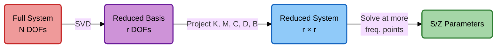
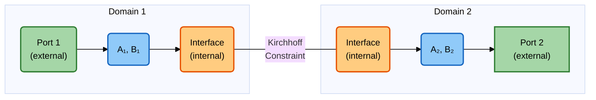
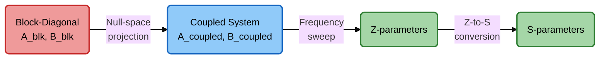

# Mathematical Theory

**cavsim3d** solves the frequency-domain Maxwell's equations using the **Finite Element Method (FEM)** and accelerates wideband analysis through **Model Order Reduction (MOR)**.

---

## 1. Maxwell's Equations

In the frequency domain, assuming an $e^{j\omega t}$ time dependence:

$$
\nabla \times \mathbf{E} = -j\omega \mu \mathbf{H}
$$

$$
\nabla \times \mathbf{H} = j\omega \varepsilon \mathbf{E} + \sigma\mathbf{E}
$$

where:

- $\omega = 2\pi f$ is the angular frequency
- $\mu = \mu_0\mu_r$ is the magnetic permeability
- $\varepsilon = \varepsilon_0\varepsilon_r$ is the permittivity
- $\sigma$ is the electrical conductivity of the filling medium (zero for a lossless material)

A dielectric loss tangent $\tan\delta$ and the conductivity are combined into one **complex
permittivity**,

$$
\varepsilon_c = \varepsilon_0\varepsilon_r\,(1 - j\tan\delta) - j\,\frac{\sigma}{\omega},
$$

so that $\nabla \times \mathbf{H} = j\omega\varepsilon_c\mathbf{E}$. The walls themselves are perfect
conductors; $\sigma$ and $\tan\delta$ describe losses in the volume.

### Vector Wave Equation

Taking the curl of the first equation and substituting the second yields the second-order equation for $\mathbf{E}$:

$$
\nabla \times \left( \frac{1}{\mu_r} \nabla \times \mathbf{E} \right) - k_0^2 \frac{\varepsilon_c}{\varepsilon_0} \mathbf{E} = \mathbf{0}
$$

where $k_0 = \omega\sqrt{\mu_0\varepsilon_0}$ is the free-space wavenumber. For a lossless material
$\varepsilon_c/\varepsilon_0 = \varepsilon_r$. This is the core equation solved by **FrequencyDomainSolver**.

---

## 2. Variational Formulation

To solve numerically via FEM, we multiply by a test function $\mathbf{v} \in H(\text{curl})$ and
integrate over the volume $\Omega$. Using 

$$\int_\Omega (\nabla\times\mathbf{A})\cdot\mathbf{v} = \int_\Omega \mathbf{A}\cdot(\nabla\times\mathbf{v})
+ \oint_{\partial\Omega}(\mathbf{n}\times\mathbf{A})\cdot\mathbf{v}$$ 

with the outward normal $\mathbf{n}$, and $\frac{1}{\mu}\nabla\times\mathbf{E} = -j\omega\mathbf{H}$, and dividing by $\mu_0$:

$$
\int_\Omega \frac{1}{\mu_0\mu_r} (\nabla \times \mathbf{E}) \cdot (\nabla \times \mathbf{v}) \, \mathrm{d}\Omega
- \omega^2 \int_\Omega \varepsilon_c \, \mathbf{E} \cdot \mathbf{v} \, \mathrm{d}\Omega
- j\omega \oint_{\partial\Omega} (\mathbf{n} \times \mathbf{H}) \cdot \mathbf{v} \, \mathrm{d}S
= 0
$$

Keeping $1/\mu_0$ in the curl term (rather than absorbing $\mu_0$ into the mass term) is the
scaling used; with it, the port excitation of §3.2 enters without extra factors.

The boundary conditions are applied using the surface integral term:

| Boundary | Condition | Effect |
|----------|-----------|--------|
| **PEC** | $\mathbf{n} \times \mathbf{E} = 0$ | Perfect conductor (default for cavity walls) |
| **PMC** | $\mathbf{n} \times \mathbf{H} = 0$ | Perfect magnetic conductor (any boundary that is not constrained) |
| **Port** | $\mathbf{n} \times \mathbf{H} = \sum_m I_m \mathbf{e}_m$ | Modal current excitation for Z-parameter extraction |

!!! info "Ports are driven by current"
    A port face is a natural boundary on which the tangential magnetic field is prescribed
    by the modal currents $I_m$ (§4). An undriven port therefore sees $\mathbf{n}\times\mathbf{H}=0$ --
    an open circuit, i.e. a magnetic wall. This is what makes the extracted quantity an
    impedance matrix $\mathbf{Z}$; the scattering matrix is derived from it (§5). Ports are not
    absorbing boundaries: a port face does not by itself absorb an outgoing wave.

### Discretisation

We expand the electric field in terms of Nédélec (edge) basis functions:

$$
\mathbf{E} \approx \sum_{i} x_i \mathbf{N}_i
$$

and choose the test function $\mathbf{v} = \mathbf{N}_j$ (Galerkin method) for each degree of freedom $j$.
Substituting into the variational form:

$$
\int_\Omega \frac{1}{\mu_0\mu_r}
  \left(\nabla \times \sum_{i} x_i \mathbf{N}_i\right)
  \cdot (\nabla \times \mathbf{N}_j) \, \mathrm{d}\Omega
\;-\; \omega^2 \int_\Omega \varepsilon_c
  \left(\sum_{i} x_i \mathbf{N}_i\right)
  \cdot \mathbf{N}_j \, \mathrm{d}\Omega
\;-\; j\omega \oint_{\partial\Omega}
  (\mathbf{n} \times \mathbf{H}) \cdot \mathbf{N}_j \, \mathrm{d}S
= 0
$$

We now treat each term separately.

---

#### Term 1 — Stiffness (Curl–Curl)

Using linearity of the curl operator, pull the sum and coefficients out of the integral:

$$
\int_\Omega \frac{1}{\mu_0\mu_r}
  \left(\sum_i x_i \,\nabla \times \mathbf{N}_i\right)
  \cdot (\nabla \times \mathbf{N}_j) \, \mathrm{d}\Omega
\;=\;
\sum_i x_i
  \underbrace{
    \int_\Omega \frac{1}{\mu_0\mu_r}
    (\nabla \times \mathbf{N}_i) \cdot (\nabla \times \mathbf{N}_j)
    \, \mathrm{d}\Omega
  }_{K_{ji}}
$$

Define the **stiffness matrix**:

$$
\boxed{
  K_{ji} = \int_\Omega \frac{1}{\mu_0\mu_r}\,
  (\nabla \times \mathbf{N}_i) \cdot (\nabla \times \mathbf{N}_j)
  \, \mathrm{d}\Omega
}
$$

!!! note "The static null space"
    The curl–curl operator vanishes on gradient fields ($\nabla \times \nabla \phi = \mathbf{0}$), so
    $\mathbf{K}$ on its own is singular. The system matrix $\mathbf{K} - \omega^2\mathbf{M}$ is not:
    for $\omega > 0$ the mass term is negative definite on those gradients. No regularisation
    is added, so the frequency sweep, the reduced models and the eigenmode analysis all use
    exactly the same $\mathbf{K}$ and $\mathbf{M}$. The gradients reappear only in the
    eigenvalue problem, as a large cluster of modes at $\omega^2 = 0$ (§8), and the sweep must
    start above $f = 0$.

So Term 1 becomes $\displaystyle\sum_i K_{ji}\, x_i$.

---

#### Term 2 — Mass and Losses

Split the complex permittivity into its lossless part and its two loss mechanisms,
$\varepsilon_c = \varepsilon_0\varepsilon_r - j\,\varepsilon_0\varepsilon_r\tan\delta - j\sigma/\omega$, and
expand as before:

$$
\omega^2 \int_\Omega \varepsilon_c
  \left(\sum_i x_i \,\mathbf{N}_i\right) \cdot \mathbf{N}_j
  \, \mathrm{d}\Omega
\;=\;
\sum_i x_i \left( \omega^2 M_{ji} - j\omega^2 D_{ji} - j\omega\, C_{ji} \right)
$$

with the **mass matrix** and the two **loss matrices**

$$
\boxed{
  M_{ji} = \varepsilon_0 \int_\Omega \varepsilon_r \, \mathbf{N}_i \cdot \mathbf{N}_j \, \mathrm{d}\Omega,
  \qquad
  D_{ji} = \varepsilon_0 \int_\Omega \varepsilon_r \tan\delta \, \mathbf{N}_i \cdot \mathbf{N}_j \, \mathrm{d}\Omega,
  \qquad
  C_{ji} = \int_\Omega \sigma \, \mathbf{N}_i \cdot \mathbf{N}_j \, \mathrm{d}\Omega
}
$$

All three are real, symmetric and frequency-independent. So Term 2 becomes
$\displaystyle -\omega^2 \sum_i M_{ji}\, x_i + j\omega^2 \sum_i D_{ji}\, x_i + j\omega \sum_i C_{ji}\, x_i$.
For a lossless structure $\mathbf{C} = \mathbf{D} = \mathbf{0}$.

---

#### Term 3 — Boundary Conditions

#### PEC Boundary

Starting from the surface integral:

$$
-j\omega \oint_{\partial\Omega}
(\mathbf{n} \times \mathbf{H}) \cdot \mathbf{v}
\,\mathrm{d}S
\;=\;
- j\omega \oint_{\partial\Omega}
\mathbf{H} \cdot (\mathbf{v} \times \mathbf{n})
\,\mathrm{d}S
$$

On PEC walls, $\mathbf{n} \times \mathbf{E} = 0$ is
an **essential (Dirichlet) boundary condition**, enforced
by constraining the edge degrees of freedom. Since the
test functions live in the same constrained space, they
must also satisfy:

$$
\mathbf{n} \times \mathbf{v}\big|_{\partial\Omega_{\text{PEC}}} = 0
$$

Therefore:

$$
-j\omega \oint_{\partial\Omega_{\text{PEC}}}
\mathbf{H} \cdot
\underbrace{(\mathbf{v} \times \mathbf{n})}_{=\,0}
\,\mathrm{d}S = 0
$$

#### PMC Boundary

For PMC, the tangential magnetic field vanishes:
$\mathbf{n} \times \mathbf{H} = 0$.
This is a **natural (Neumann) boundary condition** — the
surface integral vanishes directly without constraining
any degrees of freedom:

$$
-j\omega
\oint_{\partial\Omega_{\text{PMC}}}
\underbrace{(\mathbf{n} \times \mathbf{H})}_{= \,0}
\cdot \mathbf{v}\,\mathrm{d}S \;=\; 0
$$

No special treatment is needed: simply not imposing any
boundary condition on a surface automatically enforces PMC.

#### Source / Port Excitation
On a port face the tangential magnetic field is not unknown: it is set by the port currents,
$\mathbf{n}\times\mathbf{H} = \sum_m I_m\,\mathbf{e}_m$, where $\mathbf{e}_m$ are the port modes of
§3. The surface integral therefore does not depend on the coefficients $x_i$:

$$
-j\omega \oint_{\partial\Omega_\mathrm{port}}
  (\mathbf{n} \times \mathbf{H}) \cdot \mathbf{N}_j \, \mathrm{d}S
\;=\;
-j\omega \sum_m I_m
\underbrace{
  \oint_{\partial\Omega_\mathrm{port}}
    \mathbf{e}_m \cdot \mathbf{N}_j
    \, \mathrm{d}S
}_{b_{j,m}}
$$

Define the **excitation vector** of mode $m$:

$$
\boxed{
  b_{j,m} = \oint_{\partial\Omega_\mathrm{port}}
  \mathbf{e}_m \cdot \mathbf{N}_j
  \, \mathrm{d}S
}
$$

So Term 3 is $-j\omega\, b_j$ for a unit current, which moves to the right-hand side as $+j\omega\, b_j$.

---

#### Assembly into Matrix Form

Collecting all three terms for each test function index $j$:

$$
\sum_i K_{ji}\, x_i
\;+\; j\omega \sum_i C_{ji}\, x_i
\;-\; \omega^2 \sum_i \left(M_{ji} - jD_{ji}\right) x_i
\;=\; j\omega\, b_j
$$

Recognising the sums as matrix–vector products:

$$
\boxed{
  \left(\mathbf{K} + j\omega\,\mathbf{C} - \omega^2\,(\mathbf{M} - j\mathbf{D})\right)\mathbf{x}
  = j\omega\,\mathbf{b}
}
$$

which for a lossless structure is $(\mathbf{K} - \omega^2\mathbf{M})\,\mathbf{x} = j\omega\,\mathbf{b}$.
The system matrix is **complex symmetric** (not Hermitian) when there are losses.

where:

| Symbol | Size | Definition |
|--------|------|------------|
| $\mathbf{K}$ | $n \times n$ | Stiffness (curl–curl) matrix, with $1/\mu_0$ |
| $\mathbf{M}$ | $n \times n$ | Mass matrix, with $\varepsilon_0$ |
| $\mathbf{C}$ | $n \times n$ | Conduction loss matrix ($\sigma$) |
| $\mathbf{D}$ | $n \times n$ | Dielectric loss matrix ($\tan\delta$) |
| $\mathbf{x}$ | $n \times 1$ | Unknown edge-element coefficients |
| $\mathbf{b}$ | $n \times 1$ | Port excitation vector |
| $n$           | —    | Number of degrees of freedom |

!!! info "Notation"
    The system is solved one excitation at a time. For each port-mode pair $(p, m)$, the solver constructs a dedicated RHS vector $\mathbf{b}_{p,m}$ assembled in the excitation matrix $\mathbf{B}$ and solves for the corresponding field solution $\mathbf{x}_{p,m}$. The collection of all solutions is assembled into a solution matrix $\mathbf{X} = [\mathbf{x}_{1,1} \mid \mathbf{x}_{1,2} \mid \dots \mid \mathbf{x}_{p,m}]$.

---

## 3. Port Modal Analysis

At each waveguide port, a 2D eigenvalue problem is solved on the port
cross-section to determine the port modes $\mathbf{e}_m$ -- the transverse
electric field patterns in which the port fields are expanded.

### 3.1 Port Eigenvalue Problems

A homogeneously filled cross-section carries three families of modes. Each is
characterised by its **cutoff wavenumber** $k_{c,m}$, which depends only on the
cross-section's shape; the filling medium enters only later, through the wave
impedance and the cutoff frequency (§5.1).

**TE modes** ($E_z = 0$) solve the transverse curl–curl problem with the
tangential field vanishing on the port outline,

$$
\nabla_t \times (\nabla_t \times \mathbf{e}_m)
= k_{c,m}^2 \, \mathbf{e}_m .
$$

Every transverse gradient $\nabla_t\phi$ with $\phi = 0$ on the outline also
satisfies this equation, with $k_c = 0$. Those gradients are projected out of the
iteration, so the problem returns TE modes only.

**TM modes** ($H_z = 0$) have a transverse field that *is* a gradient, so the
curl–curl problem cannot see them. They come from the scalar Helmholtz problem
for the axial field, and the transverse mode is its gradient:

$$
-\nabla_t^2 E_z = k_{c,m}^2 \, E_z, \quad E_z = 0 \text{ on the outline},
\qquad \mathbf{e}_m = -\nabla_t E_z .
$$

**TEM modes** exist when the cross-section has more than one conductor (e.g. a
coaxial line). Their field is the gradient of a potential that is constant on
each conductor but different from one conductor to the next. Such a potential
does not vanish on the whole outline, so its gradient survives the projection
above and appears in the TE problem as a mode with $k_c = 0$. A cross-section
with $N$ separate conductors has $N - 1$ TEM modes.

**Quasi-TEM modes** of an inhomogeneous cross-section (microstrip: substrate
and air) have no closed form and no frequency-independent cutoff. They are
computed at a reference wavenumber $k_0$ from the coupled problem for the
transverse field and the axial field (a mixed $H(\mathrm{curl}) \times H^1$
formulation), whose eigenvalue is $\beta^2$ directly. The modes are ordered by
decreasing $\mathrm{Re}\,\beta$, so the fundamental quasi-TEM mode comes first.

!!! tip "Mode sources"
    For rectangular, circular and coaxial cross-sections, the code can use
    **analytic mode formulas** (fast, with a phase fixed by the formula). Any
    cross-section can instead be solved **numerically** on the port FE space,
    as described above. Both external and internal ports use the analytic
    formulas by default. Choose per call with
    `solve(mode_source=..., mode_source_internal=...)`, each `'analytic'` or
    `'numeric'`.

!!! info "Port reference frame"
    Each mode is built in a tangent frame of the port plane that does not
    depend on which way the face's outward normal points. The two faces of a
    join -- whose outward normals are opposite -- therefore produce the same
    mode functions, with the same sign, which is what allows two sections to
    be coupled mode by mode (§7).

#### Port Eigenmode Expansion

The port eigenmodes are computed on the 2D port surface $\Gamma_p$
using the **same Nédélec basis functions** as the 3D domain, but
restricted (traced) to the port boundary. Specifically, the $m$-th
port eigenmode field is expanded as:

$$
\mathbf{e}_m = \sum_i (\hat{e}_m)_i \, \mathbf{N}_i^{\text{trace}}
$$

where $(\hat{e}_m)_i$ are the expansion coefficients forming the
discrete eigenvector $\hat{\mathbf{e}}_m \in \mathbb{R}^{n_p}$, and $\mathbf{N}_i^{\text{trace}}$ is the tangential trace of the $i$-th Nédélec edge basis function onto the port surface $\partial\Omega_{\text{port}}$. Here $n_p$ is the number of edge
degrees of freedom on the port.

!!! note "Notation"
    Throughout this section we distinguish between:

    - $\mathbf{e}_m$ — the **continuous mode field** (a function on
      the port surface)
    - $\hat{\mathbf{e}}_m$ — the **discrete coefficient vector**
      (the eigenvector in $\mathbb{R}^{n_p}$)

    They are related by
    $\mathbf{e}_m = \sum_i (\hat{e}_m)_i \,
    \mathbf{N}_i^{\text{trace}}$.

The discrete problems below are the Galerkin forms of the continuous problems of
§3.1. Besides the traced Nédélec functions $\mathbf{N}_i$, they use scalar ($H^1$)
basis functions $L_i$ on the port, one polynomial order higher, so that every
gradient $\nabla_t L_i$ lies in the span of the $\mathbf{N}_i$. On the conductor
edges of the port outline the tangential field and the scalar field are zero.

**TE modes.** Testing the transverse curl–curl equation with each
$\mathbf{N}_j^{\text{trace}}$ gives the 2D eigenvalue problem on
$\partial\Omega_{\text{port}}$:

$$
\int_{\partial\Omega_{\text{port}}}
(\nabla_t \times \mathbf{e}_m) \cdot
(\nabla_t \times \mathbf{N}_j^{\text{trace}})
\,\mathrm{d}S
= k_{c,m}^2
\int_{\partial\Omega_{\text{port}}}
\mathbf{e}_m \cdot \mathbf{N}_j^{\text{trace}}
\,\mathrm{d}S
$$

which in matrix form reads:

$$
\mathbf{K}_{\text{port}}\,\hat{\mathbf{e}}_m
= k_{c,m}^2\,\mathbf{M}_{\text{port}}\,\hat{\mathbf{e}}_m
$$

where:

$$
(K_{\text{port}})_{ji}
= \int_{\partial\Omega_{\text{port}}}
  (\nabla_t \times \mathbf{N}_i^{\text{trace}})
  \cdot
  (\nabla_t \times \mathbf{N}_j^{\text{trace}})
  \,\mathrm{d}S,
\quad
(M_{\text{port}})_{ji}
= \int_{\partial\Omega_{\text{port}}}
  \mathbf{N}_i^{\text{trace}}
  \cdot
  \mathbf{N}_j^{\text{trace}}
  \,\mathrm{d}S
$$

and $k_{c,m}$ is the cutoff wavenumber of the $m$-th mode.

Every discrete gradient also solves this problem, with $k_c = 0$. Let $\mathbf{G}$ be
the matrix that maps the coefficients of a scalar function vanishing on the outline
to the Nédélec coefficients of its gradient. The projector

$$
\mathbf{P} = \mathbf{I} - \mathbf{G}\left(\mathbf{G}^T\mathbf{M}_{\text{port}}\mathbf{G}\right)^{-1}
\mathbf{G}^T\mathbf{M}_{\text{port}}
$$

removes the gradient part of a vector (it is the $\mathbf{M}_{\text{port}}$-orthogonal
projection onto the complement of the range of $\mathbf{G}$). The lowest eigenpairs are
found by preconditioned inverse iteration (PINVIT) with the preconditioner
$\mathbf{P}\,(\mathbf{K}_{\text{port}} + \mathbf{M}_{\text{port}})^{-1}$, so the iteration
never enters the gradient space.

**TEM modes.** After the projection, $\mathbf{K}_{\text{port}}\hat{\mathbf{e}} = \mathbf{0}$
still holds for curl-free fields that are *not* gradients of functions vanishing on the
outline: the discrete harmonic fields. Such a field is the gradient of a potential that
is constant on each conductor, which is the electrostatic field of the line. There is one
for each conductor beyond the first, i.e. one per hole in the port face. They come out of
the TE iteration with $k_c^2$ at round-off level, and an eigenpair is classified as TEM when

$$
|k_c^2| \le \frac{10^{-6}}{A_p},
$$

where $A_p$ is the port area (the lowest TE mode has $k_c^2 \sim \pi^2/A_p$). The TEM
field therefore needs no separate electrostatic solve. A scalar Laplace problem with the
potential set to zero on *every* conductor could not find it: that problem has no zero
eigenvalue, and its eigenfunctions are the TM modes.

**TM modes.** The scalar problem for the axial field is discretised in the port's $H^1$
space, $E_{z,m} = \sum_i (\hat{u}_m)_i\,L_i$ with $E_{z,m} = 0$ on the outline:

$$
\int_{\partial\Omega_{\text{port}}} \nabla_t E_{z,m} \cdot \nabla_t L_j \,\mathrm{d}S
= k_{c,m}^2 \int_{\partial\Omega_{\text{port}}} E_{z,m}\, L_j \,\mathrm{d}S ,
$$

or in matrix form
$\mathbf{S}_{\text{port}}\,\hat{\mathbf{u}}_m = k_{c,m}^2\,\mathbf{T}_{\text{port}}\,\hat{\mathbf{u}}_m$,
with $(S_{\text{port}})_{ji} = \int \nabla_t L_i \cdot \nabla_t L_j \,\mathrm{d}S$ and
$(T_{\text{port}})_{ji} = \int L_i L_j \,\mathrm{d}S$. No projection is needed, because
with $E_z = 0$ on the outline the problem has no zero eigenvalue. It is solved by PINVIT
with the preconditioner $(\mathbf{S}_{\text{port}} + \mathbf{T}_{\text{port}})^{-1}$. The
transverse mode $\mathbf{e}_m = -\nabla_t E_{z,m}$ lies in the Nédélec trace space, since
the scalar space is one order higher, so it is transferred into that space without
approximation.

**Assembling the mode set.** TEM, TE and TM modes are merged and sorted by $k_c$, TEM
first. Modes whose cutoffs agree to a relative $10^{-3}$ form a degenerate group (for
example the two $\mathrm{TE}_{11}$ polarisations of a circular guide), which is rotated to the
requested polarisation angle. Each mode then gets the sign fixed by the port's tangent
frame and is normalised as in §3.2, and the lowest $m_p$ modes are kept.

**Quasi-TEM modes.** On an inhomogeneous cross-section the transverse and axial fields
are coupled and have to be solved together. With
$\mathbf{E} = (\mathbf{e}_t + \hat{\mathbf{z}}\,e_z)\,e^{-j\beta z}$ and non-magnetic media
($\mu_r = 1$), the wave equation
$\nabla\times\nabla\times\mathbf{E} - k_0^2\varepsilon_r\mathbf{E} = 0$ splits into

$$
\nabla_t\times\nabla_t\times\mathbf{e}_t - k_0^2\varepsilon_r\,\mathbf{e}_t -
j\beta\,\nabla_t e_z = -\beta^2\,\mathbf{e}_t ,
\qquad
-\nabla_t^2 e_z - k_0^2\varepsilon_r\, e_z - j\beta\,\nabla_t\cdot\mathbf{e}_t = 0 .
$$

Substituting $p = j\beta\,e_z$ makes both equations linear in $\beta^2$. Testing with
$(\mathbf{f}, q)$ from $H(\mathrm{curl}) \times H^1$ on the port gives

$$
\begin{aligned}
&\int_{\partial\Omega_{\text{port}}} \left[(\nabla_t\times\mathbf{e}_t)\cdot(\nabla_t\times\mathbf{f}) -
k_0^2\varepsilon_r\,\mathbf{e}_t\cdot\mathbf{f}\right]\mathrm{d}S -
\int_{\partial\Omega_{\text{port}}} \nabla_t p\cdot\mathbf{f}\,\mathrm{d}S \\
&\qquad = -\beta^2 \int_{\partial\Omega_{\text{port}}} \mathbf{e}_t\cdot\mathbf{f}\,\mathrm{d}S ,
\end{aligned}
$$

$$
\int_{\partial\Omega_{\text{port}}} \left[\nabla_t p\cdot\nabla_t q -
k_0^2\varepsilon_r\,p\,q\right]\mathrm{d}S
= \beta^2 \int_{\partial\Omega_{\text{port}}} \mathbf{e}_t\cdot\nabla_t q\,\mathrm{d}S .
$$

The divergence term was integrated by parts. Its boundary term vanishes on the conductors,
where $q = 0$; on any other part of the outline it is dropped, which makes that part a
magnetic wall. In matrix form this is the generalised eigenvalue problem

$$
\begin{bmatrix} \mathbf{A}_{tt} & \mathbf{A}_{tz} \\ \mathbf{0} & \mathbf{A}_{zz} \end{bmatrix}
\begin{bmatrix} \hat{\mathbf{e}} \\ \hat{\mathbf{p}} \end{bmatrix}
= \beta^2
\begin{bmatrix} -\mathbf{M}_{tt} & \mathbf{0} \\ \mathbf{B}_{zt} & \mathbf{0} \end{bmatrix}
\begin{bmatrix} \hat{\mathbf{e}} \\ \hat{\mathbf{p}} \end{bmatrix} ,
$$

with

$$
\begin{aligned}
(A_{tt})_{ji} &= \int \left[(\nabla_t\times\mathbf{N}_i)\cdot(\nabla_t\times\mathbf{N}_j) -
 k_0^2\varepsilon_r\,\mathbf{N}_i\cdot\mathbf{N}_j\right]\mathrm{d}S, \\
(A_{tz})_{ji} &= -\int \nabla_t L_i\cdot\mathbf{N}_j \,\mathrm{d}S, \\
(A_{zz})_{ji} &= \int \left[\nabla_t L_i\cdot\nabla_t L_j - k_0^2\varepsilon_r\,L_i L_j\right]\mathrm{d}S, \\
(M_{tt})_{ji} &= \int \mathbf{N}_i\cdot\mathbf{N}_j \,\mathrm{d}S, \qquad
(B_{zt})_{ji} = \int \mathbf{N}_i\cdot\nabla_t L_j \,\mathrm{d}S .
\end{aligned}
$$

The eigenvalue is $\beta^2$ itself, and a propagating mode has
$k_0^2 \le \beta^2 \le k_0^2\,\varepsilon_{r,\max}$, between air and the densest filling.
The problem is solved by shift-and-invert Arnoldi with the shift
$1.15\,k_0^2\,\varepsilon_{r,\max}$, just above that range. An eigenpair is kept as a
physical propagating mode when $\mathrm{Re}\,\beta > 0$,
$|\mathrm{Im}\,\beta| < 0.3\,\mathrm{Re}\,\beta$ and
$1 \le \varepsilon_{\text{eff}} = \beta^2/k_0^2 \le 1.15\,\varepsilon_{r,\max}$. The kept modes
are sorted by decreasing $\mathrm{Re}\,\beta$.

The port mode is $\mathbf{e}_t$ alone; $\hat{\mathbf{p}}$ is discarded. The eigenvector is
real up to one global phase. That phase is read from the non-conjugated product
$\int \mathbf{e}_t\cdot\mathbf{e}_t\,\mathrm{d}S$ and removed, and the real field is
normalised like the other modes. The mode is solved once, at
$k_0 = 2\pi f_{\max}/c_0$ (the top of the sweep band), and the same field pattern and
$\varepsilon_{\text{eff}}$ are used at every frequency of the sweep, so the dispersion
of the quasi-TEM mode across the band is neglected. Its reference impedance $Z_{PV}$ is
computed from this field (§5.2).

!!! info "Why the same basis?"
    Using the trace of the 3D Nédélec basis on the port
    — rather than an independent 2D basis — ensures that
    the coefficient vector $\hat{\mathbf{e}}_m$ lives directly
    in the same discrete space as the 3D field $\mathbf{E}$.
    A numerically computed mode therefore slots into the
    corresponding global DOFs on the port face without any
    interpolation. An analytic mode formula is interpolated into
    this space once, when the mode is created.

### 3.2 Building the Right-Hand Side (b)

The right-hand side vector $\mathbf{b}$ encodes the port modal
excitation. For each port $p$ and mode $m$, the excitation is a
boundary integral over the port surface.

Starting from the boundary integral for the $j$-th component of the
right-hand side vector:

$$
b_{j,p,m} = \int_{\partial\Omega_{\text{port}}}
\mathbf{e}_{p,m} \cdot \mathbf{N}_j^{\text{trace}}
\,\mathrm{d}S
$$

Substitute the basis expansion
$\mathbf{e}_{p,m} = \sum_i (\hat{e}_{p,m})_i \,
\mathbf{N}_i^{\text{trace}}$:

$$
b_{j,p,m} = \int_{\partial\Omega_{\text{port}}}
\left(\sum_i (\hat{e}_{p,m})_i \,
\mathbf{N}_i^{\text{trace}}\right)
\cdot \mathbf{N}_j^{\text{trace}}
\,\mathrm{d}S
$$

Pull the sum and coefficients out of the integral:

$$
 b_{j,p,m} = \sum_i (\hat{e}_{p,m})_i
\underbrace{
  \int_{\partial\Omega_{\text{port}}}
  \mathbf{N}_i^{\text{trace}} \cdot \mathbf{N}_j^{\text{trace}}
  \,\mathrm{d}S
}_{(M_{\text{port}})_{ji}}
$$

This reveals the **port boundary mass matrix**:

$$
(M_{\text{port}})_{ji} = \int_{\partial\Omega_{\text{port}}}
\mathbf{N}_i^{\text{trace}} \cdot \mathbf{N}_j^{\text{trace}}
\,\mathrm{d}S
$$

Recognising the sum as a matrix–vector product, the full
right-hand side vector for port $p$, mode $m$ is:

$$
\mathbf{b}_{p,m} = M_{\text{port}} \, \hat{\mathbf{e}}_{p,m}
$$

where $\hat{\mathbf{e}}_{p,m} \in \mathbb{R}^{n_p}$ is the discrete
eigenvector of the port eigenvalue problem, containing the
coefficients $(\hat{e}_{p,m})_i$.

!!! info "Normalisation"
    Each mode is normalised to unit **power-like norm** over the port surface --
    the $L^2$ integral of the field, not the Euclidean length of its coefficient
    vector:

    $$
    \int_{\partial\Omega_\text{port}} |\mathbf{e}_m|^2 \,\mathrm{d}S
    \;=\; \hat{\mathbf{e}}_m^{\,T}\, \mathbf{M}_{\text{port}}\, \hat{\mathbf{e}}_m \;=\; 1,
    \qquad
    \hat{\mathbf{e}}_m \leftarrow
        \frac{\hat{\mathbf{e}}_m}{\sqrt{\hat{\mathbf{e}}_m^{\,T}\mathbf{M}_{\text{port}}\hat{\mathbf{e}}_m}} .
    $$

    Different modes of the same port are orthogonal in this inner product.

The solver assembles these vectors for all port-mode pairs and
collects them column-wise into the **port basis matrix**:

$$
\mathbf{B} = \bigl[\mathbf{b}_{1,1} \mid \mathbf{b}_{1,2} \mid \cdots \mid \mathbf{b}_{P,m_P}\bigr] \in \mathbb{R}^{n \times N_{pm}},
\qquad N_{pm} = \sum_{p=1}^{P} m_p
$$

where $P$ is the number of ports and $m_p$ the number of modes carried by port $p$
(ports may carry different numbers of modes, e.g. one TEM mode on a coaxial port
and several TE/TM modes on a waveguide port). The general equation therefore for
multiple ports and multiple modes per port is:

$$
  \left(\mathbf{K} + j\omega\,\mathbf{C} - \omega^2\,(\mathbf{M} - j\mathbf{D})\right)\mathbf{X}
  = j\omega\,\mathbf{B}
$$

!!! note "Where the $j$ goes"
    The solver factors the constant $j$ out of the right-hand side, solving

    $$
      \left(\mathbf{K} + j\omega\,\mathbf{C} - \omega^2\,(\mathbf{M} - j\mathbf{D})\right)\mathbf{X} = \omega\,\mathbf{B}
    $$

    so the field coefficients are $j\mathbf{X}$, and the $j$ is reinstated during the
    Z-extraction of [Section 4](#4-z-parameter-extraction). For a lossless structure
    this keeps $\mathbf{K}$, $\mathbf{M}$, $\mathbf{B}$ and $\mathbf{X}$ real, which is what
    makes the POD basis of [Section 6](#6-model-order-reduction-pod) real as well. Every
    subsequent section carries the $\omega\,\mathbf{B}$ form.

---

## 4. Z-Parameter Extraction

With the port fields expanded in the normalised modes, every port-mode $m$ carries a
**modal voltage** and a **modal current**:

$$
V_m = \int_{\partial\Omega_\text{port}} \mathbf{E}\cdot\mathbf{e}_m\,\mathrm{d}S ,
\qquad
\mathbf{n}\times\mathbf{H}\big|_\text{port} = \sum_m I_m\,\mathbf{e}_m .
$$

The current is the excitation of §2; the voltage is read off the solution. Since the
field coefficients are $j\mathbf{X}$ and $\int \mathbf{N}_i\cdot\mathbf{e}_m\,\mathrm{d}S = b_{i,m}$,
the voltages for unit-current excitations are $j\mathbf{B}^T\mathbf{X}$. After solving the linear
system for all excitations at a given frequency, the impedance matrix is therefore a single
matrix product:

$$
\mathbf{Z}(\omega) = j \, \mathbf{B}^T \mathbf{X}(\omega)
$$

where $\mathbf{X} = [\mathbf{x}_{1,1} \mid \dots \mid \mathbf{x}_{P,m_P}]$ is the matrix of solution
vectors (one column per excitation) and $\mathbf{B}$ is the (real) port basis matrix. Because
the system matrix is symmetric -- complex symmetric with losses -- $\mathbf{Z}$ is symmetric:
the structure is reciprocal. For a lossless structure $\mathbf{Z}$ is purely imaginary.

## 5. Reference Impedances and S-Parameters

### 5.1 Characteristic (Wave) Impedance
Each port mode has a frequency-dependent characteristic impedance. With the propagation
constant $\gamma_m = \sqrt{k_{c,m}^2 - \varepsilon_r\mu_r k_0^2}$ (taken with
$\mathrm{Re}\,\gamma_m \ge 0$), the TE, TM and TEM wave impedances are

$$
Z_\mathrm{TE} = \frac{j\omega\mu}{\gamma_m}, \qquad
Z_\mathrm{TM} = \frac{\gamma_m}{j\omega\varepsilon}, \qquad
Z_\mathrm{TEM} = \eta = \sqrt{\mu/\varepsilon} .
$$

Above cutoff $\gamma_m = j\beta_m$ and these reduce to the familiar forms

$$ Z_\mathrm{TE} = \frac{\eta}{\sqrt{1 - \left( \frac{f_{c,m}}{f} \right)^2}} , \qquad
   Z_\mathrm{TM} = \eta \sqrt{1 - \left( \frac{f_{c,m}}{f} \right)^2} . $$

Below cutoff $\gamma_m$ is real and positive (an evanescent, decaying mode for $e^{j\omega t}$),
so $Z_\mathrm{TE}$ is **inductive** ($+j$) and $Z_\mathrm{TM}$ is **capacitive** ($-j$). The square
roots in the familiar forms must then be read on that branch,
$\sqrt{1 - (f_c/f)^2} = -j\sqrt{(f_c/f)^2 - 1}$.

Here $f_{c,m}$ is the cutoff frequency of the $m$-th mode at port $p$. Both $\eta$ and $f_{c,m}$
are taken in the medium that fills the port: $\eta = \eta_0\sqrt{\mu_r/\varepsilon_r}$ and
$f_{c,m} = c_0 k_{c,m} / (2\pi\sqrt{\varepsilon_r\mu_r})$, where $k_{c,m}$ depends only on the
cross-section. A dielectric filling therefore lowers the cutoff as well as the impedance.

With the modes normalised as in §3.2, a single forward-travelling mode has
$I_m = V_m / Z_{w,m}$ and carries the power $\tfrac12 V_m I_m^*$: the modal $V$ and $I$ are
normalised to the **wave impedance** $Z_{w,m}$, which is therefore the natural reference.
The reference impedance matrix is:

$$ \mathbf{Z}_{\mathrm{ref}} = \begin{bmatrix}
Z_{\mathrm{ref},1,1} & 0 & \dots & 0 \\
0 & Z_{\mathrm{ref},1,2} & \dots & 0 \\
\vdots & \vdots & \ddots & \vdots \\
0 & 0 & \dots & Z_{\mathrm{ref},P,m_P}
\end{bmatrix} $$

where $Z_{\mathrm{ref},p,m}$ is the reference impedance of port $p$, mode $m$. It could be a TE, TM, or TEM mode.

### 5.2 Reference Impedance: Wave versus Line

The impedances of §5.1 are physical properties of the mode. The impedance used to *normalise*
$\mathbf{S}$ is a separate matter -- a **convention** -- and for TEM and quasi-TEM modes the
two do not coincide.

A TE or TM mode has no usable voltage between conductors. The transverse field of a TE mode
is not a gradient, so $\int \mathbf{E}\cdot\mathrm{d}\mathbf{l}$ between two conductor points
depends on the path taken. The transverse field of a TM mode is the gradient $-\nabla_t E_z$,
but $E_z = 0$ on every conductor, so that integral is zero for any path. The wave impedance is
then the only impedance available, and it is used as the reference.

A TEM mode does possess a unique voltage and current, because its transverse electric field
is the gradient of a potential that takes a *different* constant value on each conductor.
Three further impedances therefore exist,

$$ Z_{PV} = \frac{|V|^2}{2P}, \qquad Z_{PI} = \frac{2P}{|I|^2}, \qquad Z_{VI} = \frac{V}{I} $$

with $P$ the time-averaged power crossing the port. For a lossless, homogeneously filled TEM
line the three agree and reduce to the classical line impedance. For a coaxial cross-section
of inner radius $a$ and outer radius $b$,

$$ Z_0 = \frac{\eta}{2\pi}\ln\frac{b}{a} , \qquad \eta = \eta_0\sqrt{\mu_r/\varepsilon_r} $$

which depends on the **geometry**, whereas the TEM wave impedance $Z_\mathrm{TEM} = \eta$
depends only on the **medium**. For an inhomogeneous cross-section (a quasi-TEM line such as
microstrip) the three definitions separate, and $Z_{PV}$ is used.

In the code, TEM and quasi-TEM modes are referenced to the line impedance and TE/TM modes to
their wave impedance, which is the convention CST uses. The choice is made per mode: the
higher (TE, TM) modes of a coaxial port are referenced to their own wave impedance, not to
the line impedance of its TEM mode. It is selectable through `impedance_reference`, either
`'line'` (default) or `'wave'`.

**The S-matrix cannot reveal the choice.** Let $\mathbf{A} = \mathrm{diag}(\alpha_1, \dots,
\alpha_N)$, $\alpha_i > 0$, collect the per-mode ratio between the two references, so that
changing convention maps

$$ \mathbf{Z} \mapsto \mathbf{A}^{1/2}\mathbf{Z}\,\mathbf{A}^{1/2}, \qquad
   \mathbf{Z}_\mathrm{ref} \mapsto \mathbf{A}\,\mathbf{Z}_\mathrm{ref} . $$

Since $\mathbf{A}$ and $\mathbf{Z}_\mathrm{ref}$ are both diagonal they commute, and
$\mathbf{A}\mathbf{Z}_\mathrm{ref} = \mathbf{A}^{1/2}\mathbf{Z}_\mathrm{ref}\mathbf{A}^{1/2}$.
Substituting into the conversion of §5.3 gives

$$ \mathbf{A}^{-1/2}\mathbf{Z}_\mathrm{ref}^{-1/2}
   \cdot \mathbf{A}^{1/2}(\mathbf{Z} - \mathbf{Z}_\mathrm{ref})\mathbf{A}^{1/2}
   \cdot \mathbf{A}^{-1/2}(\mathbf{Z} + \mathbf{Z}_\mathrm{ref})^{-1}\mathbf{A}^{-1/2}
   \cdot \mathbf{A}^{1/2}\mathbf{Z}_\mathrm{ref}^{1/2} = \mathbf{S} , $$

so every factor of $\mathbf{A}$ cancels and $\mathbf{S}$ is **invariant** under the change of
reference. Only $\mathbf{Z}$ moves. A code that normalises to the wave impedance while
reporting line-referenced $Z$ therefore agrees with CST on $S$ and sits at a constant
per-port factor on $Z$ -- a discrepancy that no S-parameter comparison can detect.

### 5.3 Z-to-S Conversion
The S-parameters are obtained from the Z-parameters using the generalised **pseudo-wave**
conversion (Marks & Williams) -- the convention used by CST and HFSS for multimode
S-parameters. Unlike Kurokawa power-waves it does not require $\mathrm{Re}(Z_0) > 0$, so it
stays valid for the purely reactive $Z_0$ of a mode below cutoff:

$$ \mathbf{S} = \mathbf{Z}_{\mathrm{ref}}^{-1/2} (\mathbf{Z} - \mathbf{Z}_{\mathrm{ref}})(\mathbf{Z} + \mathbf{Z}_{\mathrm{ref}})^{-1} \mathbf{Z}_{\mathrm{ref}}^{1/2} $$

### 5.4 The Impedance Matrix (Recovery)
The impedance matrix can be recovered from the S-matrix via:

$$ \mathbf{Z} = \mathbf{Z}_{\mathrm{ref}}^{1/2} (\mathbf{I} + \mathbf{S})(\mathbf{I} - \mathbf{S})^{-1} \mathbf{Z}_{\mathrm{ref}}^{1/2} $$

---

## 6. Model Order Reduction (POD)

Solving the full system at every frequency point is expensive. **Proper Orthogonal Decomposition (POD)** creates a compact basis from a few sampled solutions.

### Step-by-Step:

1. **Compute snapshots** at $N_s$ "master" frequencies $\omega_1, \dots, \omega_{N_s}$, one column
   per excitation and frequency:

    $$
    \mathbf{X}_s = [\mathbf{X}(\omega_1) \mid \dots \mid \mathbf{X}(\omega_{N_s})] \in \mathbb{R}^{n \times N_s N_{pm}}
    $$

    For a lossy structure the snapshots are complex, and the real and imaginary parts are
    used as separate snapshots, $[\,\mathrm{Re}\,\mathbf{X}_s \mid \mathrm{Im}\,\mathbf{X}_s\,]$, so that
    the basis stays real.

2. **Singular Value Decomposition (SVD)** of the snapshot matrix:

    $$
    \mathbf{X}_s = \mathbf{U} \mathbf{\Sigma} \mathbf{Y}^T
    $$

3. **Truncate** at the rank $r$ that keeps every singular value with $\sigma_i / \sigma_1 > \text{tol}$:

    $$
    \mathbf{V} = \mathbf{U}_{:, 1:r}
    $$

4. **Project** the system onto the reduced basis (a Galerkin projection; $\mathbf{V}$ is real):

    $$
    \bigl(\tilde{\mathbf{K}} + j\omega\tilde{\mathbf{C}} - \omega^2(\tilde{\mathbf{M}} - j\tilde{\mathbf{D}})\bigr)\hat{\mathbf{X}} = \omega\,\tilde{\mathbf{B}},
    \qquad
    \tilde{\mathbf{K}} = \mathbf{V}^T\mathbf{K}\mathbf{V},\;
    \tilde{\mathbf{M}} = \mathbf{V}^T\mathbf{M}\mathbf{V},\;
    \tilde{\mathbf{C}} = \mathbf{V}^T\mathbf{C}\mathbf{V},\;
    \tilde{\mathbf{D}} = \mathbf{V}^T\mathbf{D}\mathbf{V},\;
    \tilde{\mathbf{B}} = \mathbf{V}^T\mathbf{B}
    $$

    where $\mathbf{X} \approx \mathbf{V}\hat{\mathbf{X}}$, $\hat{\mathbf{X}} \in \mathbb{C}^{r \times N_{pm}}$, and
    $\tilde{\mathbf{K}}, \tilde{\mathbf{M}}, \tilde{\mathbf{C}}, \tilde{\mathbf{D}} \in \mathbb{R}^{r \times r}$.

5. **Solve** the $r \times r$ system at each frequency (milliseconds).

!!! tip "Mass-weighted spectral transformation"

    1. Eigendecompose the reduced mass matrix: $\tilde{\mathbf{M}} = \mathbf{Q} \mathbf{\Lambda} \mathbf{Q}^T$
       (eigenvalues that are numerically zero are dropped)
    2. Compute $\mathbf{Q}_L^{-1} = \mathbf{Q} \mathbf{\Lambda}^{-1/2}$, so that $(\mathbf{Q}_L^{-1})^T\tilde{\mathbf{M}}\,\mathbf{Q}_L^{-1} = \mathbf{I}$
    3. Transform: $\hat{\mathbf{A}} = (\mathbf{Q}_L^{-1})^T \tilde{\mathbf{K}} \, \mathbf{Q}_L^{-1}$, $\;\hat{\mathbf{B}} = (\mathbf{Q}_L^{-1})^T \tilde{\mathbf{B}}$,
       and likewise $\hat{\mathbf{C}}$, $\hat{\mathbf{D}}$
    4. With $\hat{\mathbf{X}} = \mathbf{Q}_L^{-1}\mathbf{Y}$ the reduced system becomes

        $$
        \bigl(\hat{\mathbf{A}} + j\omega\hat{\mathbf{C}} - \omega^2(\mathbf{I} - j\hat{\mathbf{D}})\bigr)\,\mathbf{Y} = \omega \hat{\mathbf{B}},
        \qquad \mathbf{Z} = j\,\hat{\mathbf{B}}^T\mathbf{Y},
        \qquad \mathbf{X} \approx \mathbf{V}\mathbf{Q}_L^{-1}\mathbf{Y} .
        $$

    For a lossless structure ($\hat{\mathbf{C}} = \hat{\mathbf{D}} = \mathbf{0}$) a single
    eigendecomposition $\hat{\mathbf{A}} = \mathbf{\Phi}\mathbf{\Lambda}\mathbf{\Phi}^T$ solves every
    frequency at once, $\mathbf{Y} = \omega\,\mathbf{\Phi}\,\mathrm{diag}\bigl(1/(\lambda_i - \omega^2)\bigr)\mathbf{\Phi}^T\hat{\mathbf{B}}$,
    and the eigenvalues $\lambda_i$ of $\hat{\mathbf{A}}$ are the squared resonant angular
    frequencies of the reduced model (§8). With losses each frequency is a small dense solve.

```mermaid
%%{init: {'theme': 'base', 'themeVariables': {'fontSize': '14px'}}}%%
graph LR
    A("Full System<br/>N DOFs"):::full -->|"SVD"| B("Reduced Basis<br/>r DOFs"):::basis
    B -->|"Project K, M, C, D, B"| C("Reduced System<br/>r × r"):::reduced
    C -->|"Solve at more<br/>freq. points"| D("S/Z Parameters"):::result
    classDef full fill:#ef9a9a,stroke:#c62828,stroke-width:2px,color:#000
    classDef basis fill:#ce93d8,stroke:#6a1b9a,stroke-width:2px,color:#000
    classDef reduced fill:#90caf9,stroke:#1565c0,stroke-width:2px,color:#000
    classDef result fill:#a5d6a7,stroke:#2e7d32,stroke-width:2px,color:#000
```

!!! warning "Training band"
    A reduced model is accurate only over the frequency range its snapshots covered.
    Sweeping outside that band extrapolates.

---

## 7. Concatenation

For multi-domain structures, the per-domain **system matrices** ($\hat{\mathbf{A}}_d, \hat{\mathbf{B}}_d$, and $\hat{\mathbf{C}}_d, \hat{\mathbf{D}}_d$ for lossy domains) are concatenated into a single coupled system via **Kirchhoff constraints** at shared interfaces. The coupled system is then solved directly for the global Z-parameters, from which the S-parameters are derived.

!!! note "System-level coupling, not S-parameter cascading"
    The concatenation operates on the reduced system matrices, **not** on S-parameters. The per-domain matrices are assembled into a block-diagonal system and then projected onto a constraint-satisfying subspace that enforces field continuity at internal ports. The S-parameters are only computed at the very end from the Z-parameters of the coupled system.

### 7.1 Block-Diagonal Assembly

Each domain $d$ has a reduced system of the form (after POD, see [Section 6](#6-model-order-reduction-pod)):

$$
\bigl(\hat{\mathbf{A}}_d + j\omega\hat{\mathbf{C}}_d - \omega^2 (\mathbf{I} - j\hat{\mathbf{D}}_d)\bigr) \, \mathbf{Y}_d = \omega \, \hat{\mathbf{B}}_d
$$

where $\hat{\mathbf{A}}_d \in \mathbb{R}^{r_d \times r_d}$ is the reduced system matrix and $\hat{\mathbf{B}}_d \in \mathbb{R}^{r_d \times N_d}$ is the reduced port basis, with $N_d$ the number of port-modes in domain $d$ ($\hat{\mathbf{C}}_d = \hat{\mathbf{D}}_d = \mathbf{0}$ for a lossless domain).

The uncoupled multi-domain system is assembled as a block-diagonal:

$$
\mathbf{A}_{\text{blk}} = \begin{bmatrix} \hat{\mathbf{A}}_1 & & \\ & \hat{\mathbf{A}}_2 & \\ & & \ddots \end{bmatrix}, \qquad
\mathbf{B}_{\text{blk}} = \begin{bmatrix} \hat{\mathbf{B}}_1 & & \\ & \hat{\mathbf{B}}_2 & \\ & & \ddots \end{bmatrix}
$$

and $\mathbf{C}_{\text{blk}}$, $\mathbf{D}_{\text{blk}}$ likewise.

### 7.2 Port Classification and Kirchhoff Constraints

The port-modes are classified as **internal** (shared interfaces) or **external** (boundary ports). A permutation reorders the columns of $\mathbf{B}_{\text{blk}}$ so that:

$$
\mathbf{B}_{\text{perm}} = \mathbf{B}_{\text{blk}} \, \mathbf{P}^T = \bigl[\mathbf{B}_{\text{int}} \mid \mathbf{B}_{\text{ext}}\bigr]
$$

When two domains $d$ and $d'$ meet at an interface, the fields must be continuous across it:
the tangential electric field (the modal **voltages**) must agree, and the tangential magnetic
field must too -- which, because the two faces have opposite outward normals, means the modal
**currents** are equal and opposite. The voltages of mode $k$ on the two sides are the
corresponding rows of $\mathbf{B}_{\text{int}}^T \mathbf{Y}$, so voltage continuity is the linear constraint

$$
\mathbf{F}^T \mathbf{B}_{\text{int}}^T \, \mathbf{y} = \mathbf{0}
$$

where $\mathbf{F}$ is a matrix that encodes the connection topology (which internal port-modes
are linked, one column per linked pair, with entries $+1$ and $-1$):

$$
\mathbf{F} = 
\begin{bmatrix} 
1 & 0 & \dots & 0 \\
 -1 & 0 & \dots & 0 \\ 
 0 & 1 & \dots & 0 \\ 
 0 & -1 & \dots & 0 \\ 
 \vdots & \vdots & \ddots & \vdots \\ 
 0 & 0 & \dots & 1 \\ 
 0 & 0 & \dots & -1 
\end{bmatrix}
$$

The current balance is not imposed separately: it is the natural condition of the Galerkin
projection below, in the same way that $\mathbf{n}\times\mathbf{H}$ is the natural condition of the
full-order problem. Both sides must use the same mode functions -- same type, cutoff and
polarisation, and the same sign convention (§3.1) -- so that "mode $k$" means the same field on
either side; this is checked before coupling.

### 7.3 Null-Space Projection

$$
\mathbf{G} = \mathbf{B}_{\text{int}} \, \mathbf{F}
$$

To enforce $\mathbf{G}^T \mathbf{y} = \mathbf{0}$, the solution is restricted to the null
space of $\mathbf{G}^T$. The constraint-satisfying subspace basis is therefore any orthonormal basis
$\mathbf{N}$ of that null space; since $\mathbf{G}$ is real, $\mathbf{N}$ is chosen real:

$$
\mathbf{W}_c = \mathbf{N}, \qquad \mathbf{G}^T \mathbf{N} = \mathbf{0}, \qquad \mathbf{N}^T\mathbf{N} = \mathbf{I}
$$

Applying the orthogonal projector $\mathbf{I} - \mathbf{G}(\mathbf{G}^T
\mathbf{G})^{-1}\mathbf{G}^T$ to $\mathbf{N}$ would leave it unchanged, since
$\mathbf{G}^T \mathbf{N} = \mathbf{0}$.

### 7.4 Coupled System

The global coupled system is obtained by Galerkin projection onto $\mathbf{W}_c$:

$$
\mathbf{A}_{\text{coupled}} = \mathbf{W}_c^T \, \mathbf{A}_{\text{blk}} \, \mathbf{W}_c, \qquad
\mathbf{B}_{\text{coupled}} = \mathbf{W}_c^T \, \mathbf{B}_{\text{ext}}, \qquad
\mathbf{C}_{\text{coupled}} = \mathbf{W}_c^T \, \mathbf{C}_{\text{blk}} \, \mathbf{W}_c, \qquad
\mathbf{D}_{\text{coupled}} = \mathbf{W}_c^T \, \mathbf{D}_{\text{blk}} \, \mathbf{W}_c
$$

Because $\mathbf{W}_c$ is orthonormal, the identity mass matrix of the blocks stays the identity.
The coupled system has only the external port-modes remaining. At each frequency, the solve is:

$$
\bigl(\mathbf{A}_{\text{coupled}} + j\omega\mathbf{C}_{\text{coupled}} - \omega^2 (\mathbf{I} - j\mathbf{D}_{\text{coupled}})\bigr) \, \mathbf{y}_c = \omega \, \mathbf{B}_{\text{coupled}} \, \mathbf{u}_{\text{ext}}
$$

### 7.5 Z and S-Parameter Extraction

The Z-parameters of the coupled system are extracted in exactly the same way as for a single domain:

$$
\mathbf{Z}_{\text{global}}(\omega) = j \, \mathbf{B}_{\text{coupled}}^T \, \mathbf{y}_c
$$

($\mathbf{y}_c$ already carries one factor of $\omega$ from the right-hand side above.)

!!! tip "Efficient direct solve"
    For a lossless coupled system, the code uses an eigendecomposition of $\mathbf{A}_{\text{coupled}} = \mathbf{\Phi}\mathbf{\Lambda}\mathbf{\Phi}^T$ to solve all frequencies in one pass:

    $$
    \mathbf{Z}(\omega) = j\omega \, \mathbf{R} \, \text{diag}\!\left(\frac{1}{\lambda_i - \omega^2}\right) \mathbf{R}^T,
    \qquad \mathbf{R} = \mathbf{B}_{\text{coupled}}^T \mathbf{\Phi} .
    $$

    With losses there is no common eigenbasis, and each frequency is a small dense solve.

Finally, the S-parameters are computed from the Z-parameters using the standard conversion (see [Section 5.3](#53-z-to-s-conversion)):

$$
\mathbf{S}_{\text{global}} = \mathbf{Z}_{\mathrm{ref}}^{-1/2}
(\mathbf{Z}_{\text{global}} - \mathbf{Z}_{\mathrm{ref}})
(\mathbf{Z}_{\text{global}} + \mathbf{Z}_{\mathrm{ref}})^{-1}
\mathbf{Z}_{\mathrm{ref}}^{1/2}
$$

Here $\mathbf{Z}_{\mathrm{ref}}$ is diagonal over the **external** port-modes only -- the
internal ones are eliminated by the coupling. The $\mathbf{Z}_{\mathrm{ref}}^{\mp 1/2}$ factors
cancel only when every port-mode shares one reference impedance, which is not the case for
multimode ports.

```mermaid
%%{init: {'theme': 'base', 'themeVariables': {'fontSize': '14px'}}}%%
graph LR
    subgraph "Domain 1"
        P1("Port 1<br/>(external)"):::ext --> A1("A₁, B₁"):::solver
        A1 --> I1("Interface<br/>(internal)"):::internal
    end

    subgraph "Domain 2"
        I2("Interface<br/>(internal)"):::internal --> A2("A₂, B₂"):::solver
        A2 --> P2["Port 2<br/>(external)"]:::ext
    end

    I1 ---|"Kirchhoff<br/>Constraint"| I2

    classDef ext fill:#a5d6a7,stroke:#2e7d32,stroke-width:2px,color:#000
    classDef solver fill:#90caf9,stroke:#1565c0,stroke-width:2px,color:#000
    classDef internal fill:#ffcc80,stroke:#e65100,stroke-width:2px,color:#000
```

```mermaid
%%{init: {'theme': 'base', 'themeVariables': {'fontSize': '14px'}}}%%
graph LR
    BLK("Block-Diagonal<br/>A_blk, B_blk"):::full -->|"Null-space<br/>projection"| COUPLED("Coupled System<br/>A_coupled, B_coupled"):::reduced
    COUPLED -->|"Frequency<br/>sweep"| Z("Z-parameters"):::result
    Z -->|"Z-to-S<br/>conversion"| S("S-parameters"):::result
    classDef full fill:#ef9a9a,stroke:#c62828,stroke-width:2px,color:#000
    classDef reduced fill:#90caf9,stroke:#1565c0,stroke-width:2px,color:#000
    classDef result fill:#a5d6a7,stroke:#2e7d32,stroke-width:2px,color:#000
```

The internal port DOFs are eliminated, leaving a coupled system with only external ports.

---

## 8. Resonant Modes

The resonances of a model are the non-trivial solutions of the source-free problem, the
generalised eigenvalue problem

$$
\mathbf{K}\,\mathbf{x} = \omega^2\,\mathbf{M}\,\mathbf{x}
$$

(for a reduced model, $\hat{\mathbf{A}}\,\mathbf{y} = \omega^2\,\mathbf{y}$; for a coupled one,
$\mathbf{A}_{\text{coupled}}\,\mathbf{y} = \omega^2\,\mathbf{y}$). Three properties matter when reading
the results:

- **Port faces are magnetic walls.** An undriven port is an open circuit (§2), so the
  resonances are those of the structure with $\mathbf{n}\times\mathbf{H} = 0$ on every port face,
  not those of a closed metal cavity. A waveguide section of length $L$ with PEC walls
  resonates at $f = \tfrac{c}{2}\sqrt{(m/a)^2 + (n/b)^2 + (p/L)^2}$ with $p \ge 0$ for TE modes and
  $p \ge 1$ for TM modes -- the TE$_{mn0}$ resonance sits exactly at the cutoff frequency. (A fully
  closed PEC box has the opposite rule: TE modes from $p = 1$, TM modes from $p = 0$.)
- **The static null space.** Every gradient field is an eigenvector with $\omega^2 = 0$ (§2). A
  numerical eigensolver returns these at round-off level rather than exactly zero, so modes
  below 1 MHz are treated as static and removed.
- **Shift-invert.** The full-order problem is large and sparse, so only the modes nearest a
  target $\sigma$ (in $\omega^2$) are computed. Because the static modes sit at distance $\sigma$ from
  it, only physical modes below $2\sigma$ can be found. The default target is the centre of the
  solved band, $\sigma = \tfrac12(\omega_\text{min}^2 + \omega_\text{max}^2)$, which places every
  in-band mode closer than the static ones; before any sweep it is $(2\pi c_0/L)^2$ for the
  model's largest extent $L$. A different target can be passed as `sigma`.

The eigenvalue analysis uses the lossless operators $\mathbf{K}$ and $\mathbf{M}$; losses
($\mathbf{C}$, $\mathbf{D}$) shift and damp the resonances but are not included in it.

---

## Summary of the Solve Pipeline

The following table summarises the key mathematical objects and where they appear in the pipeline
($N_{pm}$ is the total number of port-modes):

| Object | Symbol | Size | Description |
|--------|--------|------|-------------|
| Stiffness matrix | $\mathbf{K}$ | $n \times n$ | Curl-curl bilinear form: $\int \frac{1}{\mu_0\mu_r}(\nabla \times \mathbf{N}_i) \cdot (\nabla \times \mathbf{N}_j) \,\mathrm{d}\Omega$ |
| Mass matrix | $\mathbf{M}$ | $n \times n$ | $\varepsilon$-weighted inner product: $\int \varepsilon_0\varepsilon_r \, \mathbf{N}_i \cdot \mathbf{N}_j \,\mathrm{d}\Omega$ |
| Loss matrices | $\mathbf{C}, \mathbf{D}$ | $n \times n$ | $\int \sigma\,\mathbf{N}_i\cdot\mathbf{N}_j$ and $\int \varepsilon_0\varepsilon_r\tan\delta\,\mathbf{N}_i\cdot\mathbf{N}_j$; zero if lossless |
| Port basis matrix | $\mathbf{B}$ | $n \times N_{pm}$ | Boundary mass-weighted port modes (see [Section 3.2](#32-building-the-right-hand-side-b)) |
| Solution | $\mathbf{X}$ | $n \times N_{pm}$ | Solves $(\mathbf{K} + j\omega\mathbf{C} - \omega^2(\mathbf{M} - j\mathbf{D}))\mathbf{X} = \omega\mathbf{B}$; the field coefficients are $j\mathbf{X}$ |
| Z-parameters | $\mathbf{Z}$ | $N_{pm} \times N_{pm}$ | Impedance matrix: $j\mathbf{B}^T\mathbf{X}$ |
| S-parameters | $\mathbf{S}$ | $N_{pm} \times N_{pm}$ | Scattering matrix: $\mathbf{Z}_\mathrm{ref}^{-1/2}(\mathbf{Z}-\mathbf{Z}_\mathrm{ref})(\mathbf{Z}+\mathbf{Z}_\mathrm{ref})^{-1}\mathbf{Z}_\mathrm{ref}^{1/2}$ |
| POD basis | $\mathbf{V}$ | $n \times r$ | Truncated left singular vectors of the (real) snapshot matrix |
| Reduced system | $\hat{\mathbf{A}}_d, \hat{\mathbf{B}}_d$ | $r_d \times r_d$, $r_d \times N_d$ | Per-domain Galerkin-projected, mass-normalised matrices ($r_d \ll n$) |
| Block-diagonal system | $\mathbf{A}_{\text{blk}}$ | $r_\mathrm{blk} \times r_\mathrm{blk}$ | Block-diagonal assembly of all per-domain $\hat{\mathbf{A}}_d$ ($r_\mathrm{blk} = \sum r_d$) |
| Constraint matrix | $\mathbf{G}$ | $r_\mathrm{blk} \times c$ | Kirchhoff coupling: $\mathbf{G} = \mathbf{B}_{\text{int}} \mathbf{F}$ |
| Coupled system | $\mathbf{A}_{\text{coupled}}, \mathbf{B}_{\text{coupled}}$ | $r_c \times r_c$ | Null-space projected system with internal ports eliminated |
