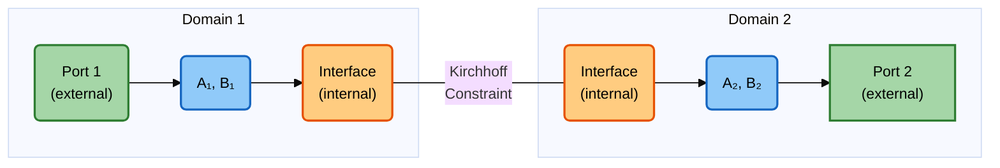
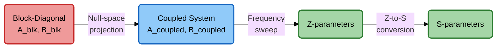

# 7. Concatenation

For multi-domain structures, the per-domain **system matrices** ($\hat{\mathbf{A}}_d, \hat{\mathbf{B}}_d$, and $\hat{\mathbf{C}}_d, \hat{\mathbf{D}}_d$ for lossy domains) are concatenated into a single coupled system via **Kirchhoff constraints** at shared interfaces, as in the state-space concatenation method[^flisgen13][^flisgen15]. The coupled system is then solved directly for the global Z-parameters, from which the S-parameters are derived.

!!! note "System-level coupling, not S-parameter cascading"
    The concatenation operates on the reduced system matrices, **not** on S-parameters. The per-domain matrices are assembled into a block-diagonal system and then projected onto a constraint-satisfying subspace that enforces field continuity at internal ports. The S-parameters are only computed at the very end from the Z-parameters of the coupled system.

## 7.1 Block-Diagonal Assembly

Each domain $d$ has a reduced system of the form (after POD, see [Section 6](reduction.md)):

$$
\bigl(\hat{\mathbf{A}}_d + j\omega\hat{\mathbf{C}}_d - \omega^2 (\mathbf{I} - j\hat{\mathbf{D}}_d)\bigr) \, \mathbf{Y}_d = \omega \, \hat{\mathbf{B}}_d
$$

where $\hat{\mathbf{A}}_d \in \mathbb{R}^{r_d \times r_d}$ is the reduced system matrix and $\hat{\mathbf{B}}_d \in \mathbb{R}^{r_d \times N_d}$ is the reduced port basis, with $N_d$ the number of port-modes in domain $d$ ($\hat{\mathbf{C}}_d = \hat{\mathbf{D}}_d = \mathbf{0}$ for a lossless domain).

The uncoupled multi-domain system is assembled as a block-diagonal:

$$
\mathbf{A}_{\text{blk}} = \begin{bmatrix} \hat{\mathbf{A}}_1 & & \\ & \hat{\mathbf{A}}_2 & \\ & & \ddots \end{bmatrix}, \qquad
\mathbf{B}_{\text{blk}} = \begin{bmatrix} \hat{\mathbf{B}}_1 & & \\ & \hat{\mathbf{B}}_2 & \\ & & \ddots \end{bmatrix}
$$

and $\mathbf{C}_{\text{blk}}$, $\mathbf{D}_{\text{blk}}$ likewise.

## 7.2 Port Classification and Kirchhoff Constraints

The port-modes are classified as **internal** (shared interfaces) or **external** (boundary ports). A permutation reorders the columns of $\mathbf{B}_{\text{blk}}$ so that:

$$
\mathbf{B}_{\text{perm}} = \mathbf{B}_{\text{blk}} \, \mathbf{P}^T = \bigl[\mathbf{B}_{\text{int}} \mid \mathbf{B}_{\text{ext}}\bigr]
$$

When two domains $d$ and $d'$ meet at an interface, the fields must be continuous across it:
the tangential electric field (the modal **voltages**) must agree, and the tangential magnetic
field must too -- which, because the two faces have opposite outward normals, means the modal
**currents** are equal and opposite. The voltages of mode $k$ on the two sides are the
corresponding rows of $\mathbf{B}_{\text{int}}^T \mathbf{Y}$, so voltage continuity is the linear constraint

$$
\mathbf{F}^T \mathbf{B}_{\text{int}}^T \, \mathbf{y} = \mathbf{0}
$$

where $\mathbf{F}$ is a matrix that encodes the connection topology (which internal port-modes
are linked, one column per linked pair, with entries $+1$ and $-1$):

$$
\mathbf{F} = 
\begin{bmatrix} 
1 & 0 & \dots & 0 \\
 -1 & 0 & \dots & 0 \\ 
 0 & 1 & \dots & 0 \\ 
 0 & -1 & \dots & 0 \\ 
 \vdots & \vdots & \ddots & \vdots \\ 
 0 & 0 & \dots & 1 \\ 
 0 & 0 & \dots & -1 
\end{bmatrix}
$$

The current balance is not imposed separately: it is the natural condition of the Galerkin
projection below, in the same way that $\mathbf{n}\times\mathbf{H}$ is the natural condition of the
full-order problem. Both sides must use the same mode functions -- same type, cutoff and
polarisation, and the same sign convention ([§3.1](ports.md#31-port-eigenvalue-problems)) -- so that "mode $k$" means the same field on
either side; this is checked before coupling.

## 7.3 Null-Space Projection

$$
\mathbf{G} = \mathbf{B}_{\text{int}} \, \mathbf{F}
$$

To enforce $\mathbf{G}^T \mathbf{y} = \mathbf{0}$, the solution is restricted to the null
space of $\mathbf{G}^T$. The constraint-satisfying subspace basis is therefore any orthonormal basis
$\mathbf{N}$ of that null space; since $\mathbf{G}$ is real, $\mathbf{N}$ is chosen real:

$$
\mathbf{W}_c = \mathbf{N}, \qquad \mathbf{G}^T \mathbf{N} = \mathbf{0}, \qquad \mathbf{N}^T\mathbf{N} = \mathbf{I}
$$

Applying the orthogonal projector $\mathbf{I} - \mathbf{G}(\mathbf{G}^T
\mathbf{G})^{-1}\mathbf{G}^T$ to $\mathbf{N}$ would leave it unchanged, since
$\mathbf{G}^T \mathbf{N} = \mathbf{0}$.

## 7.4 Coupled System

The global coupled system is obtained by Galerkin projection onto $\mathbf{W}_c$:

$$
\mathbf{A}_{\text{coupled}} = \mathbf{W}_c^T \, \mathbf{A}_{\text{blk}} \, \mathbf{W}_c, \qquad
\mathbf{B}_{\text{coupled}} = \mathbf{W}_c^T \, \mathbf{B}_{\text{ext}}, \qquad
\mathbf{C}_{\text{coupled}} = \mathbf{W}_c^T \, \mathbf{C}_{\text{blk}} \, \mathbf{W}_c, \qquad
\mathbf{D}_{\text{coupled}} = \mathbf{W}_c^T \, \mathbf{D}_{\text{blk}} \, \mathbf{W}_c
$$

Because $\mathbf{W}_c$ is orthonormal, the identity mass matrix of the blocks stays the identity.
The coupled system has only the external port-modes remaining. At each frequency, the solve is:

$$
\bigl(\mathbf{A}_{\text{coupled}} + j\omega\mathbf{C}_{\text{coupled}} - \omega^2 (\mathbf{I} - j\mathbf{D}_{\text{coupled}})\bigr) \, \mathbf{y}_c = \omega \, \mathbf{B}_{\text{coupled}} \, \mathbf{u}_{\text{ext}}
$$

## 7.5 Z and S-Parameter Extraction

The Z-parameters of the coupled system are extracted in exactly the same way as for a single domain:

$$
\mathbf{Z}_{\text{global}}(\omega) = j \, \mathbf{B}_{\text{coupled}}^T \, \mathbf{y}_c
$$

($\mathbf{y}_c$ already carries one factor of $\omega$ from the right-hand side above.)

!!! tip "Efficient direct solve"
    For a lossless coupled system, the code uses an eigendecomposition of $\mathbf{A}_{\text{coupled}} = \mathbf{\Phi}\mathbf{\Lambda}\mathbf{\Phi}^T$ to solve all frequencies in one pass:

    $$
    \mathbf{Z}(\omega) = j\omega \, \mathbf{R} \, \text{diag}\!\left(\frac{1}{\lambda_i - \omega^2}\right) \mathbf{R}^T,
    \qquad \mathbf{R} = \mathbf{B}_{\text{coupled}}^T \mathbf{\Phi} .
    $$

    With losses there is no common eigenbasis, and each frequency is a small dense solve.

Finally, the S-parameters are computed from the Z-parameters using the standard conversion (see [Section 5.3](s_parameters.md#53-z-to-s-conversion)):

$$
\mathbf{S}_{\text{global}} = \mathbf{Z}_{\mathrm{ref}}^{-1/2}
(\mathbf{Z}_{\text{global}} - \mathbf{Z}_{\mathrm{ref}})
(\mathbf{Z}_{\text{global}} + \mathbf{Z}_{\mathrm{ref}})^{-1}
\mathbf{Z}_{\mathrm{ref}}^{1/2}
$$

Here $\mathbf{Z}_{\mathrm{ref}}$ is diagonal over the **external** port-modes only -- the
internal ones are eliminated by the coupling. The $\mathbf{Z}_{\mathrm{ref}}^{\mp 1/2}$ factors
cancel only when every port-mode shares one reference impedance, which is not the case for
multimode ports.

The internal port DOFs are eliminated, leaving a coupled system with only external ports.

## References

///Footnotes Go Here///

[^flisgen13]: T. Flisgen, H.-W. Glock and U. van Rienen, "Compact time-domain models of
    complex RF structures based on the real eigenmodes of segments," *IEEE Trans. Microw.
    Theory Techn.* **61**(6) (2013).
[^flisgen15]: T. Flisgen, *Compact State-Space Models for Complex Superconducting
    Radio-Frequency Structures Based on Model Order Reduction and Concatenation Methods*,
    doctoral thesis, Universität Rostock (2015).
    [rosdok_disshab_0000001633](https://rosdok.uni-rostock.de/resolve/id/rosdok_disshab_0000001633)

---

**Next:** [8. Resonant modes](resonances.md)
