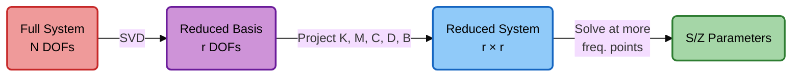

# 6. Model Order Reduction (POD)

Solving the full system at every frequency point is expensive. **Proper Orthogonal Decomposition (POD)**[^sirovich][^benner] creates a compact basis from a few sampled solutions.

## Step-by-Step:

1. **Compute snapshots** at $N_s$ "master" frequencies $\omega_1, \dots, \omega_{N_s}$, one column
   per excitation and frequency:

    $$
    \mathbf{X}_s = [\mathbf{X}(\omega_1) \mid \dots \mid \mathbf{X}(\omega_{N_s})] \in \mathbb{R}^{n \times N_s N_{pm}}
    $$

    For a lossy structure the snapshots are complex, and the real and imaginary parts are
    used as separate snapshots, $[\,\mathrm{Re}\,\mathbf{X}_s \mid \mathrm{Im}\,\mathbf{X}_s\,]$, so that
    the basis stays real.

2. **Singular Value Decomposition (SVD)** of the snapshot matrix:

    $$
    \mathbf{X}_s = \mathbf{U} \mathbf{\Sigma} \mathbf{Y}^T
    $$

3. **Truncate** at the rank $r$ that keeps every singular value with $\sigma_i / \sigma_1 > \text{tol}$:

    $$
    \mathbf{V} = \mathbf{U}_{:, 1:r}
    $$

4. **Project** the system onto the reduced basis (a Galerkin projection; $\mathbf{V}$ is real):

    $$
    \bigl(\tilde{\mathbf{K}} + j\omega\tilde{\mathbf{C}} - \omega^2(\tilde{\mathbf{M}} - j\tilde{\mathbf{D}})\bigr)\hat{\mathbf{X}} = \omega\,\tilde{\mathbf{B}},
    \qquad
    \tilde{\mathbf{K}} = \mathbf{V}^T\mathbf{K}\mathbf{V},\;
    \tilde{\mathbf{M}} = \mathbf{V}^T\mathbf{M}\mathbf{V},\;
    \tilde{\mathbf{C}} = \mathbf{V}^T\mathbf{C}\mathbf{V},\;
    \tilde{\mathbf{D}} = \mathbf{V}^T\mathbf{D}\mathbf{V},\;
    \tilde{\mathbf{B}} = \mathbf{V}^T\mathbf{B}
    $$

    where $\mathbf{X} \approx \mathbf{V}\hat{\mathbf{X}}$, $\hat{\mathbf{X}} \in \mathbb{C}^{r \times N_{pm}}$, and
    $\tilde{\mathbf{K}}, \tilde{\mathbf{M}}, \tilde{\mathbf{C}}, \tilde{\mathbf{D}} \in \mathbb{R}^{r \times r}$.

5. **Solve** the $r \times r$ system at each frequency (milliseconds).

!!! tip "Mass-weighted spectral transformation"

    1. Eigendecompose the reduced mass matrix[^gvl]: $\tilde{\mathbf{M}} = \mathbf{Q} \mathbf{\Lambda} \mathbf{Q}^T$
       (eigenvalues that are numerically zero are dropped)
    2. Compute $\mathbf{Q}_L^{-1} = \mathbf{Q} \mathbf{\Lambda}^{-1/2}$, so that $(\mathbf{Q}_L^{-1})^T\tilde{\mathbf{M}}\,\mathbf{Q}_L^{-1} = \mathbf{I}$
    3. Transform: $\hat{\mathbf{A}} = (\mathbf{Q}_L^{-1})^T \tilde{\mathbf{K}} \, \mathbf{Q}_L^{-1}$, $\;\hat{\mathbf{B}} = (\mathbf{Q}_L^{-1})^T \tilde{\mathbf{B}}$,
       and likewise $\hat{\mathbf{C}}$, $\hat{\mathbf{D}}$
    4. With $\hat{\mathbf{X}} = \mathbf{Q}_L^{-1}\mathbf{Y}$ the reduced system becomes

        $$
        \bigl(\hat{\mathbf{A}} + j\omega\hat{\mathbf{C}} - \omega^2(\mathbf{I} - j\hat{\mathbf{D}})\bigr)\,\mathbf{Y} = \omega \hat{\mathbf{B}},
        \qquad \mathbf{Z} = j\,\hat{\mathbf{B}}^T\mathbf{Y},
        \qquad \mathbf{X} \approx \mathbf{V}\mathbf{Q}_L^{-1}\mathbf{Y} .
        $$

    For a lossless structure ($\hat{\mathbf{C}} = \hat{\mathbf{D}} = \mathbf{0}$) a single
    eigendecomposition $\hat{\mathbf{A}} = \mathbf{\Phi}\mathbf{\Lambda}\mathbf{\Phi}^T$ solves every
    frequency at once, $\mathbf{Y} = \omega\,\mathbf{\Phi}\,\mathrm{diag}\bigl(1/(\lambda_i - \omega^2)\bigr)\mathbf{\Phi}^T\hat{\mathbf{B}}$,
    and the eigenvalues $\lambda_i$ of $\hat{\mathbf{A}}$ are the squared resonant angular
    frequencies of the reduced model ([§8](resonances.md)). With losses each frequency is a small dense solve.

!!! warning "Training band"
    A reduced model is accurate only over the frequency range its snapshots covered.
    Sweeping outside that band extrapolates, and its resonances are listed only near the
    band ([§8](resonances.md)).

## References

///Footnotes Go Here///

[^sirovich]: L. Sirovich, "Turbulence and the dynamics of coherent structures. Part I:
    Coherent structures," *Q. Appl. Math.* **45**(3), 561–571 (1987).
    [doi:10.1090/qam/910462](https://doi.org/10.1090/qam/910462)
[^benner]: P. Benner, S. Gugercin and K. Willcox, "A survey of projection-based model
    reduction methods for parametric dynamical systems," *SIAM Rev.* **57**(4), 483–531 (2015).
    [doi:10.1137/130932715](https://doi.org/10.1137/130932715)
[^gvl]: G. H. Golub and C. F. Van Loan, *Matrix Computations*, 4th ed. (Johns Hopkins
    University Press, Baltimore, 2013), ch. 8.

---

**Next:** [7. Concatenation](concatenation.md)
