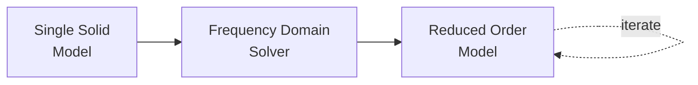

# Tutorial: Pathway 1 — Single Solid Analysis

This tutorial covers the simplest analysis pathway: a single geometry solved with the Frequency Domain Solver (FDS) and accelerated with Model Order Reduction (ROM).



## Example: Rectangular Waveguide

We simulate a standard rectangular waveguide and compare the numerical result against the **analytical solution**.

### 1. Create Geometry

```python
from geometry.primitives import RectangularWaveguide

a = 100e-3   # Width: 100 mm
L = 200e-3   # Length: 200 mm

rwg = RectangularWaveguide(a=a, L=L, maxh=0.04)
print(f"Cutoff (TE10): {rwg.cutoff_frequency_TE10 / 1e9:.3f} GHz")
print(f"Mesh vertices: {rwg.mesh.nv}")
```

!!! info "About Primitives"
    `RectangularWaveguide` automatically creates the OCC geometry, identifies the two port faces, and generates the mesh. Other built-in primitives include `CircularWaveguide` and `Box`.

### 2. Visualise the Geometry and Mesh

```python
rwg.show('geometry')  # 3D geometry view
rwg.show('mesh')      # 3D mesh view
```

### 3. Create the Solver and Assemble Matrices

```python
from solvers.frequency_domain import FrequencyDomainSolver

fds = FrequencyDomainSolver(rwg, order=3)
fds.assemble_matrices(nmodes=1)
fds.print_info()
```

This step:

1. Builds the $H(\text{curl})$ finite element space on the mesh.
2. Solves the 2D port eigenvalue problem on each port face to find the modal basis functions $\mathbf{e}_m$.
3. Assembles the global stiffness matrix $\mathbf{K}$, mass matrix $\mathbf{M}$, and port excitation matrix $\mathbf{B}$.

### 4. Solve the Full-Order Model (FOM)

```python
results = fds.solve(fmin=1.5, fmax=3.0, nsamples=30, store_snapshots=True)
```

At each frequency point $\omega_i$, the solver computes:

\[
(\mathbf{K} - \omega_i^2 \mathbf{M}) \mathbf{x}_i = \mathbf{B} \mathbf{a}_i
\]

The solution vectors $\mathbf{x}_i$ are the **snapshots** used later for model reduction.

### 5. Build the Reduced-Order Model (ROM)

```python
from rom.reduction import ModelOrderReduction

rom = ModelOrderReduction(fds)
rom.reduce(tol=1e-6)
rom.print_info()  # Shows the reduced basis rank
```

POD computes the SVD of the snapshot matrix:

\[
[\mathbf{x}_1, \dots, \mathbf{x}_N] = \mathbf{U} \mathbf{\Sigma} \mathbf{W}^H
\]

Modes with singular values below `tol` × $\sigma_{\max}$ are discarded. The reduced system is:

\[
\mathbf{V}^H (\mathbf{K} - \omega^2 \mathbf{M}) \mathbf{V} \tilde{\mathbf{x}} = \mathbf{V}^H \mathbf{B} \mathbf{a}
\]

### 6. Solve the ROM (Wideband)

```python
results_rom = rom.solve(fmin=1.5, fmax=3.0, nsamples=500)
```

This solves the small reduced system (typically rank 10–30) at 500 frequency points in **milliseconds**.

### 7. Compare with Analytical Solution

```python
import numpy as np
from analytical.rectangular_waveguide import RWGAnalytical

analytical = RWGAnalytical(a=a, L=L)
frequencies = np.linspace(1.5, 3.0, 200) * 1e9
Z_ana = analytical.z_parameters(frequencies)
```

### 8. Plot

```python
import matplotlib.pyplot as plt

fig, axes = plt.subplots(1, 2, figsize=(14, 5))

# S11
fds.fom.plot_s(params=['1(1)1(1)'], plot_type='db', ax=axes[0], label='FOM')
rom.plot_s(params=['1(1)1(1)'], plot_type='db', ax=axes[0], label='ROM')
axes[0].set_title('S11')

# S21
fds.fom.plot_s(params=['1(1)2(1)'], plot_type='db', ax=axes[1], label='FOM')
rom.plot_s(params=['1(1)2(1)'], plot_type='db', ax=axes[1], label='ROM')
axes[1].set_title('S21')

plt.tight_layout()
plt.show()
```

### 9. Eigenfrequency Analysis

```python
# Compute resonant frequencies from the K, M matrices
eigenfreqs = fds.get_resonant_frequencies() / 1e9
print("First 5 resonant frequencies (GHz):")
for i, f in enumerate(sorted(eigenfreqs)[:5]):
    print(f"  Mode {i+1}: {f:.4f} GHz")
```

### 10. Save the Project

```python
from core.em_project import EMProject

proj = EMProject(name='rwg_tutorial', base_dir='./simulations')
proj.geometry = rwg
proj.save()
```
