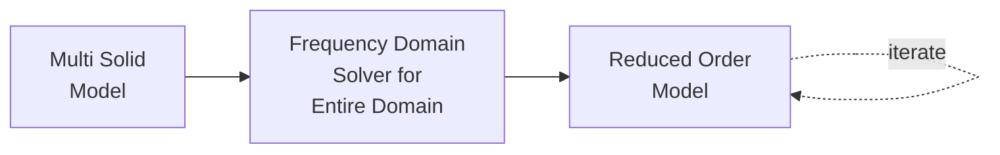

# Tutorial: Pathway 2 — Multi-Solid Global Assembly

This tutorial covers assembling multiple geometric parts into a single domain and solving the fused system globally.



## Example: Two Waveguide Sections

We create two rectangular waveguide sections, snap them together, and solve the combined structure as one domain.

### 1. Create the Project and Assembly

```python
from core.em_project import EMProject
from geometry.primitives import RectangularWaveguide

proj = EMProject(name='global_assembly', base_dir='./simulations')
assembly = proj.create_assembly(main_axis='Z')
```

### 2. Add Components

```python
wg1 = RectangularWaveguide(a=0.1, L=0.1)
wg2 = RectangularWaveguide(a=0.1, L=0.1)

assembly.add("input", wg1)
assembly.add("output", wg2, after="input")
```

!!! tip "Automatic Alignment"
    When you specify `after="input"`, the assembly automatically aligns `wg2` so that its first face is flush with the last face of `wg1`.

### 3. Build and Mesh

```python
assembly.build()
assembly.generate_mesh(maxh=0.02)
assembly.show('mesh')
```

The `build()` step fuses all parts into a single OCC solid. The resulting mesh has:

- **2 external ports** (input face of wg1, output face of wg2)
- **No internal ports** (the interface is fused)

### 4. Solve

```python
results = proj.fds.solve(fmin=1.0, fmax=4.0, nsamples=50)
```

Since the assembly is fused into a single domain, this is equivalent to Pathway 1 — the solver treats it as one big mesh.

### 5. Reduce and Solve ROM

```python
rom = proj.fds.fom.reduce(tol=1e-6)
rom.solve(fmin=1.0, fmax=4.0, nsamples=500)
```

### 6. Plot

```python
rom.plot_s(plot_type='db')
rom.plot_z(plot_type='db')
```

### 7. Save

```python
proj.save()
```

## Using Imported CAD Parts

You can also use imported STEP/IGES files instead of primitives:

```python
part1 = proj.create_importer("./cavity_cell.iges", unit='mm')
part2 = proj.create_importer("./cavity_cell.iges", unit='mm')

assembly.add("cell1", part1)
assembly.add("cell2", part2, after="cell1")
assembly.build()
```

For more details, see the [Importing CAD Files](importing_cad.md) tutorial.
