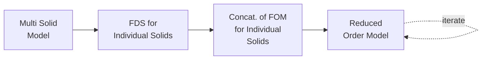

# Tutorial: Pathway 3 — FOM Concatenation

This tutorial demonstrates the **per-domain Full Order Model concatenation** workflow. Each solid is solved independently, and the resulting FOMs are concatenated via Kirchhoff coupling to produce the global response.



## When to Use This Pathway

- **Large assemblies** where a global mesh would be too memory-intensive.
- **Modular designs** where individual components can be characterised once and reused.
- When you want to **change one component** without re-solving the others.

## Example: Split Rectangular Waveguide

We create a rectangular waveguide split into two domains at the midpoint.

### 1. Create Multi-Domain Geometry

```python
from geometry.importers import OCCImporter

# Load a STEP file and split it into two domains
geom = OCCImporter('./rectangular_waveguide.step', unit='mm',
                    auto_build=False, maxh=0.04)
geom.add_splitting_plane_at_z(0.1)  # Split at z = 100 mm
geom.split()
geom.finalize(maxh=0.04)
```

After splitting, the geometry has:

- **2 domains** (left half, right half)
- **2 external ports** (input, output)
- **1 internal port** (the shared interface)

### 2. Create Solver and Assemble

```python
from solvers.frequency_domain import FrequencyDomainSolver

fds = FrequencyDomainSolver(geom, order=3)
fds.assemble_matrices(nmodes=1)
fds.print_info()  # Shows per-domain port topology
```

For each domain $d$, the solver independently assembles:

\[
\mathbf{K}_d, \quad \mathbf{M}_d, \quad \mathbf{B}_d
\]

### 3. Solve Per-Domain FOMs

```python
results = fds.solve(fmin=1.5, fmax=3.0, nsamples=30, store_snapshots=True)
```

This solves each domain independently at 30 frequency points, producing per-domain S-matrices $\mathbf{S}_d(\omega)$.

### 4. Concatenate FOMs

```python
cs = fds.foms.concatenate()
cs.couple()
cs_results = cs.solve(fmin=1.5, fmax=3.0, nsamples=30)
```

The concatenation step enforces **Kirchhoff coupling** at internal ports:

\[
\mathbf{a}_{\text{int}}^{(d)} = \mathbf{b}_{\text{int}}^{(d+1)}, \quad
\mathbf{b}_{\text{int}}^{(d)} = \mathbf{a}_{\text{int}}^{(d+1)}
\]

This cascades the per-domain S-matrices into a global 2-port S-matrix.

### 5. Reduce the Concatenated System

```python
rom = cs.reduce(tol=1e-6)
rom.solve(fmin=1.5, fmax=3.0, nsamples=500)
```

### 6. Plot and Compare

```python
import matplotlib.pyplot as plt

fig, ax = plt.subplots(1, 2, figsize=(14, 5))

# Per-domain S-parameters (individual domains)
fds.foms.plot_s(plot_type='db', ax=ax[0], title='Per-Domain S-Parameters')

# Concatenated global S-parameters
cs.plot_s(plot_type='db', ax=ax[1], title='Concatenated Global S-Parameters')

plt.tight_layout()
plt.show()
```

### 7. Access Per-Domain Results

```python
# Access individual domain results
for i, fom in enumerate(fds.foms):
    print(f"Domain {fom.domain}: {fom.n_ports} ports, "
          f"Z shape = {fom._Z_matrix.shape}")
```

## Key Advantage: Component Reuse

If you change the geometry of **only one domain**, you can re-solve just that domain and re-concatenate — the other domain's FOM is reused from disk:

```python
# After modifying domain 1's geometry:
fds.solve(fmin=1.5, fmax=3.0, nsamples=30)  # Only re-solves changed domains
cs = fds.foms.concatenate()
cs.solve(fmin=1.5, fmax=3.0, nsamples=500)
```
