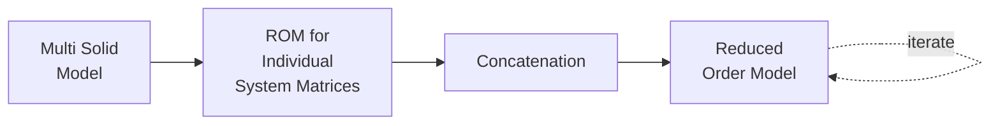
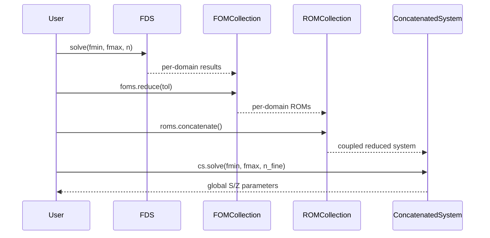

# Tutorial: Pathway 4 — ROM Concatenation

This is the **most efficient** analysis pathway. Each domain is first reduced independently via POD, and then the reduced models are concatenated. This gives massive speedups for systems with many components or repeated cells.



## When to Use This Pathway

- **Large multi-component systems** (e.g., multi-cell accelerating structures)
- **Repeated identical cells** — the ROM is computed once and reused
- When you need **thousands of frequency points** across a wide band

## Example: Split Rectangular Waveguide

### 1. Create Multi-Domain Geometry

```python
from geometry.importers import OCCImporter

geom = OCCImporter('./rectangular_waveguide.step', unit='mm',
                    auto_build=False, maxh=0.04)
geom.add_splitting_plane_at_z(0.1)
geom.split()
geom.finalize(maxh=0.04)
```

### 2. Solve Per-Domain FOMs

```python
from solvers.frequency_domain import FrequencyDomainSolver

fds = FrequencyDomainSolver(geom, order=3)
fds.assemble_matrices(nmodes=1)
results = fds.solve(fmin=1.5, fmax=3.0, nsamples=30, store_snapshots=True)
```

### 3. Reduce Each Domain Independently

```python
roms = fds.foms.reduce(tol=1e-6)
```

This creates a `ROMCollection` — one reduced model per domain. Each domain's snapshot matrix is decomposed via SVD:

\[
\mathbf{x}_1^{(d)}, \dots, \mathbf{x}_N^{(d)} = \mathbf{U}_d \mathbf{\Sigma}_d \mathbf{W}_d^H
\]

The truncated basis $\mathbf{V}_d$ projects each domain's system:

\[
\tilde{\mathbf{K}}_d = \mathbf{V}_d^H \mathbf{K}_d \mathbf{V}_d, \quad
\tilde{\mathbf{M}}_d = \mathbf{V}_d^H \mathbf{M}_d \mathbf{V}_d, \quad
\tilde{\mathbf{B}}_d = \mathbf{V}_d^H \mathbf{B}_d
\]

### 4. Concatenate the ROMs

```python
cs = roms.concatenate()
cs.couple()
```

The concatenation operates on the **reduced** matrices, which are orders of magnitude smaller than the full-order ones. Kirchhoff coupling at shared ports:

\[
\tilde{\mathbf{a}}_{\text{int}}^{(d)} = \tilde{\mathbf{b}}_{\text{int}}^{(d+1)}
\]

### 5. Solve the Concatenated ROM

```python
cs_results = cs.solve(fmin=1.5, fmax=3.0, nsamples=1000)
```

This solves the coupled reduced system at 1000 frequency points — typically in **under a second**.

### 6. Plot Results

```python
cs.plot_s(plot_type='db', title='ROM Concatenation: S-Parameters')
cs.plot_z(plot_type='db', title='ROM Concatenation: Z-Parameters')
```

## Performance Comparison

| Method | System Size | Time for 1000 freq points |
|--------|-------------|---------------------------|
| FOM (Pathway 1) | ~10,000 DOFs | ~minutes |
| ROM (Pathway 1) | ~20 DOFs | ~milliseconds |
| ROM Concat (Pathway 4) | ~40 DOFs (2×20) | ~milliseconds |

The key advantage of Pathway 4 over Pathway 1 is **modularity**: each domain's ROM is independent and can be recomputed individually.

## Workflow Summary


